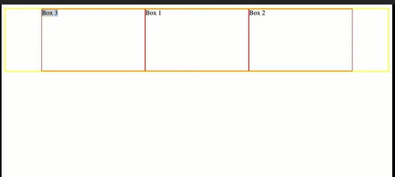

# Advanced CSS
## Flexbox
### Introducing Flexbox.

***Flexbox***, the flexible box module, specializes in aligning and distributing elements within a parent element. Alignment and justification can be made pretty easy with software such as *Adobe Illustrator*. But until Flexbox, it was relatively difficult to distribute and align elements in a visually appealing way *with just code*.

Flexbox comes around and brings a few things with it. A ***flex container*** can expand to fit the ***items*** available inside of it. A flex container unlike other CSS properties uses the main container with items then nested inside of it, and some of the CSS properties are used only for the parent and others on the items.

The terminology we will be using is container for the parent element and items for the elements inside of it. To use flexbox set the display property of a div to flex. The items inside that element will automatically become ***flex items***, and you can then use the flexbox syntax in your CSS code.

### A Quick Flexbox Example

Flexbox (the Flexible Box Module) is a set of CSS rules for stretching multiple columns or rows across a parent container. Flex is unique amongst CSS properties because you have *a main container* and *the items nested* within it. CSS flex has properties that apply to both the element itself, and the items inside of it.

To use flexbox set the display property of the parent container to flex:

    .container{

    display:flex;

    }

### Axes and Direction in Flexbox

The Flexbox model relies on two axes: the ***main axis*** and the ***cross axis***. The main axis is defined by flex-direction, which has four possible values:

-   row

-   row-reverse

-   column

-   column-reverse

The two *row* settings will create the main axis *horizontally* - or inline direction. The two column settings will create the main axis *vertically* - or block direction. block or inline here refer to the CSS display settings which we have covered previously.

The axis determines the *flow of your content* - you can think of this as being either rows or columns - and they will be determined when you start *aligning* and *justifying* content within a flex container.

### Axes and Direction in Action

After setting an element\'s display to flex, the next thing you will usually want to state is whether the elements inside the container should be laid out in *rows* or *columns*. You can do this using the flex-direction property, and setting its value to either *column* or *row*.

To set the layout of the items in a flex container to either a row or column use the flex-direction property like this:

    .container{

    display:flex;

    flex-direction: row

    }

The two axes *control the flow of space in flexbox* and correspond to the align-items and justify-content properties.

Axes and direction are important concepts for understanding flexbox. They are both conceptual and technical which can be tricky. One suggestion is to try and draw your flex containers out first in a notebook. This can be helpful for mapping out axes and direction.

**Ordering Elements with Flexbox**

There are three ways to explicitly set the order in which items will appear in a grid.

1.  *Moving the HTML code* for the elements themselves to reorder

2.  Appending -reverse to row or column *will reverse the order* in the specified row or column

3.  Using the order *property of the individual items inside the grid*

flex-direction:row; will lay elements out from left to right. But flex-direction:row-reverse will flip that order and display elements from right to left.

**Demo of using** order **property**

The way that the order works is that it\'s *relative*, so it\'ll be an evaluation where if I give \#one and \#two in order of *2* but \#three in *order of* *1*, it means \#three will come first followed by \#one and \#two, and that \#one and \#two with a shared *order of 2*, which one of those comes first will then be *thrown down to where it shows up in the HTML*.

So let\'s take a look at this, and now we see that *box three is first* because it has the order property of one while two and one have the order property of two which is the *lower value*. This property, they could share a three, a seven, it\'s all an evaluation of comparatively which has the lowest one being low value and that would come first.

**Demo of appending** -reverse **to** row **or** column **in the** flex-direction **of the parent container**

    .container {

    flex-direction: row-reverse;

    ...

    }

So with flex-direction : row we have box three, box one, box two, but with flex-direction : row-reverse, we have box two, box one, box three.

So those are some of the different ways that you can order your elements. You can either use the flex direction, flipping row, and row reverse which will just reverse or setback the order in which they\'re laid out. We have the specific order property of each of the items in a container which here are set to two and two, and the one makes this one show up first so the order will be three, two, one based on that. The third way that you can order elements using flex is simply by *doing it in the HTML itself*.

### Summary

The order of flex items is by *default* determined by the *order they appear in your code*. You can explicitly change this order using either -reverse or with the CSS property order.

#### Aligning Items & Justifying Content with Flexbox

To align items on *the cross axis* use align-items with the possible values:

-   stretch

-   flex-start

-   flex-end

-   center

To justify content on *the main axis* use justify-content, which has the possible values:

-   flex-start

-   flex-end

-   center

-   space-around

-   space-between

-   space-evenly

For more information you can visit the [MDN reference](https://developer.mozilla.org/en-US/docs/Web/CSS/CSS_Flexible_Box_Layout/Basic_Concepts_of_Flexbox#Alignment_justification_and_distribution_of_free_space_between_items)

**Recap**

We learned how the display-property:flex, on a container element can be used to control the *distribution* and *alignment* of elements inside of it. We learned to control the flex flow with flex-direction column or row. We learned how to *justify* and *align* content along the *main* and *cross* axes.

We also learned how a flex container *can expand to fit the items inside of it and to prevent overflow*. Unlike many other CSS properties, Flex has a *main container* and then inside of it it has elements that we call *items*. Some CSS Flex properties are used only on the parent and others are used on the items.
## Grid

### Grid vs Flexbox

The truth is that CSS grid does not replace flexbox. That is, *each can achieve things that the other is not capable of* and in fact, a true master can use flexbox and CSS grid together in harmony to create the ultimate web page layout. In this section, we\'ll quickly cover some of the differences between CSS grid and flexbox, highlight how they can work together, and then you\'ll take a deeper dive into the mechanics and syntax of CSS grid.

At the highest level, CSS grid excels at *creating layouts for a web page*. While flexbox is a master of *content flow for each element* that makes up the page layout.

**Meaning,**

Flexbox is for *how content flows*, Grid is for *how content is placed* - i.e. grid works nicely for *page layouts*, flex works nicely for *regions within the grid*.

### An Example of Grid vs Flexbox

An excellent way to use flexbox and grid together is by *creating the layout of a webpage with grid* and then *organizing the flow of the content with flex*. Let\'s see an example of this!

To use CSS Grid set the display property of the *container* element to grid.

**Recap**

CSS Grid v. Flexbox

-   Grid is two dimensional, while Flex is one

-   Grid is layout first, while Flexbox is content first

-   Flex is for components of an app, Grid is for the app layout itself

CSS Grid does not replace Flexbox. Each can achieve things that the other is not capable of, and in fact, a true master can use Flexbox and CSS Grid together in harmony to create the ultimate webpage layout.

At the highest level CSS Grid excels at creating layouts for a webpage, while Flexbox is a master of content flow for each element that makes up the page layout.

### Further Research

For more information on CSS Grid and Flexbox together see the articles below:

-   [Beginner's Guide to choosing between CSS Grid and Flexbox](https://medium.com/youstart-labs/beginners-guide-to-choose-between-css-grid-and-flexbox-783005dd2412)

-   [The Ultimate CSS Battle: Grid vs. Flexbox](https://hackernoon.com/the-ultimate-css-battle-grid-vs-flexbox-d40da0449faf)

-   [Does CSS Grid Replace Flexbox?](https://css-tricks.com/css-grid-replace-flexbox/)

> **Rows & Columns**

After setting the display property of your container div to grid, the next step is to set the rows and columns in your grid which can be done with the CSS properties:

-   grid-template-columns

-   grid-template-rows

And to define gutters between rows and columns you can use the property grid-gap on the parent container that has the display-property set to grid.

> **Rows & Columns in Action**

grid-template-columns is the property that defines the *column layout of your grid* - that is *how many sections the page should be divided into vertically*. The values for this property are the explicit value for each column and the *number of columns is defined implicitly by the number of values entered*. For example:

grid-template-columns: 60px 60px;

would create *two* *columns* of *60px* each. If you had two items inside your grid and didn\'t set their position explicitly, the first item would be placed in the first column and the second item in the second. grid-template-rows follows the same logic, so that:

    grid-template-columns: 60px 60px;

    grid-template-rows: 160px 60px;

would create a grid with *two columns and two rows.*

**Further Research**

To explore grid setup deeper, you can check out this cool [**grid visualizer and generator**](https://cssgrid-generator.netlify.com/).

**Grid Areas**

The grid-area property specifies a particular area or set of rows and columns that a grid item occupies. It is applied to the grid item itself with CSS. Here is an example:

    .item{

    grid-area: 1/2/3/3

    }

Because grid-area is shorthand for the properties: grid-row-start, grid-column-start, grid-row-end and grid-column-end, the code above places the item from rows 1-3, and columns 2-3.

**Working with Grid Areas**

The grid-area property defines the space an element takes up in the grid *by setting values for the row it starts and ends in, and the column it starts and ends in*. In practice it could look like this:

    #one {
    /* row start/column start/ row end/ column end */
    grid-area: 1/2/3/3;
    }

In this example the element with the id one would start at the first row and the first column, and end at the third row (which is the end of the second row if there is no third row) and the third column.

The grid-area CSS property is a shorthand property for grid-row-start, grid-column-start,  grid-row-end and grid-column-end, and it defines the area that an element occupies in a grid.

### Grid Areas Summary

grid-template-areas is the property used to name the rows and columns of a grid and to set its layout. It could look like this:

    .container {
    display:grid;
    grid-template-columns: 300px 300px 300px;
    grid-template-rows: 250px 600px;
    grid-template-areas:
    "hd hd hd hd hd hd hd hd"
    "sd sd sd main main main main main"
    "ft ft ft ft ft ft ft ft";
    }

The named areas in the grid are then assigned to each element according to where you want them to be displayed in the grid:

    .header {
    grid-area: hd;
    }

In the example above the element with the class header will stretch across the entire first row of columns because we have assigned it the grid-area hd, and we have defined the area hd with the value for grid-template-areas in the parent element.
### Advanced Grid

CSS Grid includes advanced capabilities for creating large and complex grids. Some of these are:

-   the fr Unit

-   Track listings with repeat() notation

-   Track sizing and minmax()

Let's explore these advanced features in action.

#### Fr()

Stands for *fraction*

It denotes taking up the rest of the available space

#### Repeat()

    grid-template-columns: 350px 350px 350px

is the same as

    grid-template-columns: repeat(3, 350px)

so it's really just to avoid repetiton especially as the column number gets higher

#### minmax()

    grid-auto-rows: minmax(100px,auto);

There\'s oftentimes where you\'re going to want an infinite number of rows or as many rows as there is content. Think about the way a Facebook feed works. You just continue to go down and down and down. So it\'s not like you\'re setting the number of rows initially, the number of rows need to develop from the amount of content you have. Luckily for us, CSS grid makes this fairly easy with the grid-auto-rows syntax.

Grid-auto-rows replaces grid-template-rows. In this instance, we\'re going to use grid-auto-rows with minmax. Minmax takes *two values*. The first is a minimum value that each row must be. So this is saying that each row has to be at least *100 pixels* and at most is *auto*. So what auto will do is auto will let it be as big as its content holds. So if we have giant letters, then it\'ll be a much taller row. But they have to be *at least* 100 pixels.

### Advanced Grid Recap

The fr unit represents a fraction of the available space in the grid container.

The repeat() notation can be used to quickly layout many tracks for large grids. For example:

    grid-template-columns: 1fr 1fr 1fr 1fr 1fr 1fr 1fr;

Could be written with repeat notation like this:

    grid-template-columns: repeat(7, 1fr);

The grid-auto-rows property can be used to generate the number of rows based on the content and available space. The following code:

    grid-auto-rows: minmax(100px, auto);

Would create rows that are at least 100px tall and can be as tall as the content inside them demands.
