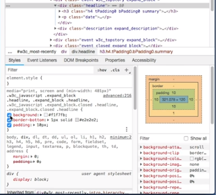
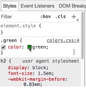
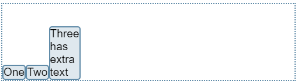
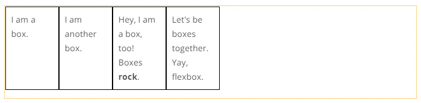

# Intro To CSS
## Starting with style

In this lesson, you are going to learn the basics of a very colorful part of the web. It is called ***CSS*** or ***Cascading Style Sheets***. It is how webpages get all their decoration, all the colors, fonts, and layout that you see on the web are provided by CSS.

Using CSS, you will be able to greatly *improve the look of your HTML pages*. That can be anything from changing the *color of your text* to completely *changing the layout*.

You will use CSS to change the **color** or the **layout** of a web page, among other things! If you want to add paragraphs or images to a web page, you will do that using HTML.

## Developer Tools

There is something special built right into your web browser that will be an incredibly huge help for learning more about HTML and CSS. It is called the \"Developer tools,\" and it is something that every web developer spends a lot of time with. When you get started with it, it can seem a little overwhelming, but it is extremely valuable.

Every browser has a developer tools window built in, but it will look a bit different from one browser to another. Here, I have got the webpage for the World Wide Web Consortium, and if I *right-click or control-click* on this page there is this option ***inspect***, this is one way to get at the developer tools.

Well, what are we inspecting? This lets me look at the *HTML elements for everything on this page*, *starting out with what I clicked on*. Each of these tabs lets you peek into a different aspect of what the browser is doing. For now, we will stick to this elements tab which shows you some HTML elements. This looks a lot like the HTML source code for this page. As I mouse over these HTML elements, *it highlights the parts of the page that correspond to them*. This element\'s view and the rendered page over on the left are *two different views of the same underlying data*.

But since we are doing CSS, it is this part down here which is interesting. If I *click on one of these elements down*, [here (in the styles tab pointed at above)]{.ul} I can see a bunch of information about the *style of that element*. It tells you about the *background*, and the *border*, and the *padding*, and the *font*, and *color*, a whole bunch of things that have to do with a style and appearance of the page.

There is a useful trick with this style pane over here. Each of these pieces of style information has [a little checkbox]{.ul} next to it. Clicking them can *turn that style* *on or off* and that means that we can use this as a tool to find out what the style settings do by looking at the effects on the rendered page, like check it out. Turning this padding setting on or off changes the padding on the page. This is something we should do a lot when we have a new tool. Find out how we can use it to investigate the world and see what we can discover about what we can change with it.

***Open one of your own HTML pages in the browser (like your notes.html page), then use Developer Tools to inspect it. Can you find any differences in the code between what you see in the Elements tab (or Inspector in Firefox), and what you see in your text editor?***

Yes, there are usually differences! The Elements tab is not showing you the original HTML source code. It is showing you *a sort of map or representation of how the browser sees the page*.

For instance, in Chrome, *many pieces of text will show up in \"double quotes\"*, which are not in the original source or in the rendered version of the page.

***Find a place in your HTML code where you did not use an optional closing tag, such as a \</li\> or \</p\> tag on a list item or paragraph.  Load the page up in your browser, and inspect it using Developer Tools. What happens?***

The browser *will show the closing tag anyway.*

Developer Tools makes this representation look like HTML, because that is a convenient way for web developers to see what is going on in the page. But the view that you see in Elements is a **picture of the way the browser thinks about the page internally** --- not just a copy of the original HTML file.

## Text to Trees

When you load up a webpage, somehow the browser takes a piece of HTML text, and it creates the two-dimensional image that appears in your browser window. But what our HTML and the image on the screen made of? Well, this HTML over here is just a piece of text. It is made of letters, and numbers, and punctuation marks, and spaces. Some of that text spells out HTML tags. Other texts make up the content of the page, like the word Apple, here. But this browser window, that is a visual image, a two-dimensional picture made of pixels on your screen, it could have text in it, or images, video, or other things.

There are things *in HTML source code that* *do not show up on the screen, like the literal text of these tags*. There are things that *show up on the screen that* *do not literally appear* in the *HTML*, like *the number 2 in "2. Betty*". It turns out that this is a little easier to understand if we look at this *intermedia-csste step*. The browser reads the HTML, and it turns it into *something here*, and then it turns that something into the view that we see on the screen.

When we make a *style change* to the page, that does *not change the structure of the HTML* source code, but it does *change the appearance*. That means the *style* is getting *mixed in* with this thing here. This something is a *data structure*.

It is an *organized map* of what is going to end up on the page. It is also what developer tools lets us look at. When the browser reads the HTML source, it *builds up a map in the computer\'s memory of what all the elements are that it will need to put on the screen*. This map shows *which elements are nested inside which other elements*.

Doing this step first makes it much more practical to lay out the elements on the screen. It is like making an *outline of the page*. This kind of structure is called a *tree structure* because each *element can have branches coming out of it to other elements*. For each element, there will be branches going to that element that are nested inside of it, like these \<li\> or list items inside the \<ol\> or ordered list, *all the way down to the individual pieces of text that occur inside the list*. The particular tree structure that the browser builds out of HTML is called the ***DOM*** or ***Document Object Model.*** The DOM has a tree structure for each HTML element, and for each piece of text, and image, and other object inside the webpage.

## Tree Structure

Tree structures are going to show up a lot in your code. They are common in computer science and in how programmers talk about the way computer languages work. So, it is useful to learn a bit about the terminology of tree structures.

A tree is made up of parts called *the **nodes** or elements of the tree* that have *connections between them* called ***branches***. The HTML elements that you have seen are an example of this, but here\'s a different example.

It is a tree that I made to list some things that are in my apartment. The *nodes are the words in boxes*. The *branches are the arrows*. This is saying that in my apartment, there is a kitchen, and a bathroom, and a bedroom, and in each of those rooms, there are some pieces of furniture. Like a refrigerator in the kitchen and a bed in the bedroom. In the refrigerator, there is a cucumber and some yogurt, and, in the bed, there are pillows.

Nodes of a tree have *relationships* between them. Here, I am *drawing those with arrows*, and they *mean this is inside that*. Like the pillows are in the bed, which is in the bedroom, which is in my apartment.

A tree always has a ***root***, which is *the top or start of the tree*. In the case of an HTML document, *the HTML element* is the ***root of the tree***. The nodes that descend from any particular node are called ***its*** ***children***. So, the *HTML element* has *the head and the body as its children*. The head node has the title as a *child* and the body has a P element and so on. We can also flip that around and say that this P element has a ***parent node*** which is body, and this would still be the case if we had several paragraphs in this document. Each of those is a separate *P* node and they all have the *body* as *their parent.*

But a tree is *not* a kind of diagram with boxes and arrows. It does *not have to be written with the* *root at the top*. It does *not have to be written at all*. A tree is a data structure. It is the *way that information can be organized*. How we write or draw that data structure is kind of secondary.

Anytime you have ever written an *outline*, like for a paper in school, or made a presentation using *bullet points inside slides*, or *classified things* *into categories* that have *subcategories*, you were using a tree structure even if you did not know it. Of course, every time you have written *html*, you are writing a tree structure too.

There are a few rules that are always true for tree structures. First, a tree starts with one node that is the root. Second, each node including the root, can have references or branches that point to other nodes. Those other nodes are that node\'s children. Third, each node has exactly one parent except for the root node which has no parent. Though each node can have any number of branches going out, it only has one branch coming in.

Additionally, a *new branch can* *never point to a node that is already in the tree*. Another way of saying this is that each node other than the root, *has only one parent*, and that is just about all the rules there are for trees.

As you go on in computing, you will find there are tree structures everywhere. The DOM or document object model, the tree structure of HTML is just one of them. *This is what you are looking at when you look in the elements tab on developer tools*. Not the original HTML source code, but a version that has been *reconstituted from the DOM tree*. That is why it looks different from the original.

## Trees to boxes

So, you have seen now how the browser turns HTML text into the tree structure of the DOM. Let\'s take a look at how it can turn that tree structure into a picture that we can see on the screen.

I am going to load up one of our sample HTML pages and check it out using *developer tools* to see what I can find.

I have a sense of how the HTML of the page has a tree structure, but how does that relate to what is on the page? So, it looks like this ol element gets rendered as a *large box*, and each of these LI elements shows up as a *smaller box inside it*.

The large box fills up the whole width of the page, while the smaller ones, each look like they take up about a fifth of the page.

Over here, in the Style pane of the developer tools, we can see this same sort of box diagram. Here, it has got some parts labeled margin, and border, and padding. This margin here might have something to do with the CSS code here that says, margin 20px.

So, we saw earlier that the browser reads the text of the HTML document and turns it into a tree structure. We had the question of how it gets from there into the two-dimensional layout of a web page on the screen. Well, *these boxes are pretty much the answer to that*. *Every element that appears on the page gets laid out into a box*, and these boxes land *inside of other boxes*. The *layout* of these boxes, well, it is *controlled by the tree structure with a little help from the CSS*.

So, for instance, the HTML code for this list will always get translated into the same tree structure, and that *tree structure will always be turned into boxes*. One big box containing three smaller boxes. But then, whether those boxes get laid out like this, *vertically*, or like this, *horizontally*, and or as *pink*, is *something that you can control with the CSS.*

## Styling HTML directly (Inline Styling)

One way that we can apply style to a webpage is to visit each node of the tree and *add the style we want*. There is a style attribute that we can put on html opening tags to do just that. For instance, if we would like to turn all these list items green, we could do that. We can add the style attribute, style equals color, colon, green, to each of the li elements.

The problem with doing it this way is that it is incredibly *repetitious,* and it is *hard to catch mistakes*. Generally, in computing, if it is possible to *avoid repeating yourself* it is nice to do so, not only does it save on typing, but it also makes for fewer places things can go wrong.

So, what CSS lets us do is to *pull all the style information out*, and say we want to apply this style to every li in the document instead of just one at a time. One way we can do that is by putting a *CSS rule set* into the document\'s *head element* by creating a special *element* called ***style***.

The style information that we put here will be applied throughout the document. As the browser builds up the picture on screen from the DOM tree, it will use these style rules to color, shape, and layout the page.

Additionally, when styles are applied directly to an HTML element using the style **attribute**, these are called **inline** styles.

The idea is that the style is being applied directly *in the same line* as the HTML element that it is styling. (In contrast, when we use the style **element**, the style is separated---it is *not* in the same line.)

### Practice

\
This is a haiku\</p\>

\
 So I want each line centered\</p\>

\
Let's make it stylish\</p\>

**Note:** You may have noticed that the semicolon ; at the end is *optional*---removing it does not seem to cause a problem. This is *true if you only have one style applied to the element*. If you want to add more styles, the semicolon must be used to separate them. For example:

\
This will be both centered and blue.\</p\>

### Quotes or no quotes?

When we use the style attribute to create an **inline** style, you may have noticed that we use *quotes*:

\
Hello!\</p\>

In fact, we seem to be using quotes whenever we have an **attribute value**.

Lets try *deleting the quotes* and *adding a space* in between color:blue; and text-align:center;. Like this:

\
Hello!\</p\>

With the quotes gone and a space added, the editor thinks that text-align:center; is an *attribute*, just like *style*.

*Without the quotes*, the browser can *sometimes still figure out* where the attribute value ends. So it\'s possible to get away with leaving the quotes off, in some cases.

But *if there is a space* (*and no quotes*) then the browser will *get confused and think the attribute value has ended right before that space.*

*The quotes indicate where an attribute value starts and stops, even if there are spaces inside it.*

*\
*

## Styling HTML separately

Now let us look at how to apply styles using the style **element**.

An Example of a style element:

\<style\>

p { text-align: center; }

\</style\>

\<p\>This is a haiku\</p\>

\<p\>So I want each line centered\</p\>

\<p\>Let's make it stylish\</p\>

Is CSS its own separate language, or is it just part of the HTML language?

-   CSS is its own separate language, with its own unique syntax.

If we just put the CSS anywhere on the page, the browser will get confused. It will try to interpret the CSS code as if it were HTML!

To signal to the browser that this code is in the CSS language, we need to put it *inside a style element or use it as the value of a style attribute.*

Here is some code that uses *separated styles*:

\<style\>

p { color:red; }

\</style\>

\<p\>Hello!\</p\>

Again, this code is made up of two different languages. Which parts are HTML and which are CSS?

## CSS Syntax

A CSS ***ruleset*** is made up of two parts, ***a selector**,* and ***a declaration block***. The selector is the part that says which html element or elements the rule is going to work on. The declaration block says how the rule will modify those elements. Here\'s that example from before, a rule-set that turns all of the list items green. The *selector* here is li, and there\'s *one entry* in the *declaration block* color:green.

CSS rules are always written like this, *the selector comes first*, and then there are these *curly braces* around the *declaration block*. Here are a couple of examples.

In this example here, the ***selector*** is p. This means that it will apply to *all paragraph elements in the document*. In this second one, the selector is .weird. This means that it will apply to *any element with the class attribute equal to weird.* We will see more about ***the class attribute*** just ahead.

*The part inside the curly braces* is called the ***declaration block***, and it consists of one or more declarations, also called rules. Each declaration tells the browser to make one specific change to the style of the selected elements. Like, here is a declaration (rule), width: 50%. This block has two declarations in it; color:purple, and font-size:larger.

You have probably noticed by now that each of these entries has a *descriptive name*, like width, or color, or font size. That is called the ***property*** that the rule is affecting. Then it has a colon, and then, the ***value*** that is giving that property. Then at the end of the rule there is *always a semicolon*. For instance, in the rule above, *color* is the *property*, and *purple* is the *value* that is being given to that property. So, the rule ends up being color:purple;.

The *syntax of CSS* is completely *different* than the *syntax of HTML* itself. But that makes sense because they are really *trying to accomplish different things*. A piece of HTML *describes a tree structure made of elements*. A CSS declaration says, *here is a particular kind of element, and here\'s some styles to apply to it.*

## Selectors:

### Type

So, a CSS selector tells the browser which elements the rule will affect. There are a lot of different kinds of selectors that you can use. But we are just going to look at a few of them for now.

The simplest one is a ***type selector***, it\'s just the name of one type of HTML element such as p or em. It can even be body, which would make the rule apply to the whole body of the HTML document.

For an example, here\'s a rule-set that will change the font for the entire document. *Type selectors* are particularly useful when you want to *apply a style widely across the web page*. For instance, if you are writing an article that uses a lot of section headings with the headline elements h1 h2 and so on, a single CSS selector will apply to all the elements of a particular type, but you still must write one CSS rule for each headline element type as shown in example above.

### Class and ID**

You do not always want to style all elements of the same type in the same way though. For instance, if your document is an article with a *sidebar*, you might want to apply a different style to paragraph elements in the article versus in the sidebar. One way you can do this is by putting a special attribute on the HTML tags, the ***class*** attribute.

In computer languages, *class is a common word for a group of things with the same characteristics*. As you go on in computing, you will see lots of other examples of classes in different languages. But for now, here, a class in html is just a special attribute that we can use to say that, for instance, some paragraphs need to have different style than other paragraphs. So, how do you create a class?

All you must do is *make up a name for that* class and start using it. You *add the class attribute to some html elements* and *create a CSS rule set with the same name*, and the way you apply a CSS rule set to a class is to write *a selector that starts with the dot*.

To sum up

-   Use a class when there could be *several elements* that need the same style.

-   Use an id when there is only *one element* to apply it to.

The difference between id and class is that id is meant to be *unique*. There can only be *one element with a particular id* on the page. In contrast, there can be any number of elements with the same class.

Id values come from the same place that class values do, *you just make them up*. But to apply a style to elements by id instead of a dot in the selector, you put a *hash mark*.

To sum up whenever you see a CSS selector *starting with*

-   *a dot*, you know you are looking at a selector that applies to the *class of elements*.

-   *a hash mark*, you know you are looking at a selector that applies to an *id element*.

### Combining Selectors

CSS also lets you combine selectors. For instance, you might want to say \'\'Make emphasized text red, but only if it\'s part of a list item.\'\'

Here is how you would do that, in the selector part of the rule, you write the selector for the parent element li, and then for the child element em (li em{}). Together, this selector means \'Select every em element that\'s a *child* of an li element. With that style applied, this html will look like this.

The em element in the list item, turns red, but the other em doesn\'t, because it\'s not part of an li. This kind of selector that uses *a space to create a combined selector*, li space em, is called the ***descendant selector***. There are a whole bunch of other kinds of selectors in CSS. I am going to suggest you look at the Mozilla CSS documentation for selectors if you\'d like to see more of them though.

***For more information on other types of selectors:***

<https://developer.mozilla.org/en-US/docs/Learn/CSS/Building_blocks/Selectors>

***What do you think happens if the selector on a rule does not match any elements in the page? For instance, what if we have a rule such as ul { color: blue; }, but we don\'t have any ul elements?***

The rule will not do anything. It is common to have *the same CSS rules for all pages* on a web site; and if a particular page does not make use of a particular rule, that is OK!

## Vocabulary review

Here are some important CSS terms that you have learned so far:

-   **DOM**, or Document Object Model, is a tree structure with a node for each HTML element, piece of text, image, and any other object in the web page.

-   **Selectors** are one part of the CSS ruleset. They indicate which HTML element(s) the rule is for.

-   **Declaration blocks** are the other part of the CSS ruleset, they say how the rule will modify the elements indicated by selectors.

-   CSS **rules** are composed of a selector followed by a declaration block.

-   **type** is the simplest kind of selector. It indicates the name of one type of HTML element (such as em or li).

-   **class** in HTML is an attribute that groups elements together that you want to have the same style.

-   **id** is an attribute that must be unique to a single element, used to identify it.

## Selectors Review

You have now learned about three kind of CSS selectors: **type**, **class**, and **ID**!

**Type** selectors are used to apply a style to a particular type of HTML element, like h1 or body. Type selectors are written using just the type name.

**Class** selectors are used to set the style for multiple HTML elements that have a particular value for the class attribute. You can name a class anything you want! Class selectors are written with a dot before the class: for elements such as \
, the class selector is .blue.

**ID** selectors are used when the style is being applied to one HTML element, which has to have an id attribute. There can be only *one* element with a particular id on a page. You can also choose any name you want for an id, just like a class. ID selectors are written using a \# sign: for an element such as \
, the id selector is \#sidebar.

We use a *semicolon* ; to show where each rule ends.

For example: p{color:green; text-align:center;}

### Class selectors

How can we *apply two classes to one element*?

This turns out to be pretty easy---we simply put in both of the class names, *separated by a space*. Like this:

\<li class=\"highlight done\"\>Make

## What\'s so \"cascading\" about CSS?**

Okay. So, you\'ve seen a bunch of things that you can do with CSS, but here\'s a question we haven\'t answered yet, what\'s so ***cascading*** about cascading style sheets? Well, cascading has to do with how each node in the DOM tree gets its styles defined.

Basically, any style property defined on a node will apply as a default to all that node's descendants. Let\'s say that we have a document whose body looks like this, and we have CSS rules like this.

What we want to know is what color will each of these text nodes become when it\'s displayed in the browser. To find out, we\'ll *walk through the DOM tree visiting each node starting at the top*. If there\'s a *CSS rule for that node*, we\'ll *apply that style to it*, but each node will *also inherit style from its parent node*.

We start with the body node. There\'s a rule for that. This rule says to make *this white text on a black background*. Then we\'ll go down the left branch to h1, *we don\'t have a rule for* h1 so it gets the *same style as its parent*. Then we go to the text node \"All about.\" That gets *the same style as its parent the* h1. Over to the em node here, we have two different rules that might give this node its color. We\'ve got a rule for em and another rule for h1 em. In this case, *the most specific selector applies*. Here, that\'s the h1 em rule. So this gets to be *orange not red*, but the h1 em rule *doesn\'t define the background color*, so, that\'ll be *inherited from above*.

This text node that says CSS, that\'ll also inherit *the orange on black style from its parent*. Over to the right side of the tree, the p node matches the CSS rule for p, so, it gets pink, p *for pink paragraph. Still inheriting the black background from the* body though, and those will cascade down to this text node but over here, we\'ve got an em node that will be painted red, and that\'ll cascade down to the text node below.

So, that\'s what so cascading about cascading style sheets. Each style property that\'s defined on a node will cascade or spill down the tree to that node\'s children and descendants. The black *background color in this example cascaded to every node on the tree*, but *each of these text colors only cascaded within a particular sub-tree.*

## Units

One of the things we can use CSS for is to *change the layout of elements on the page*. This means, we can move them around, change their sizes, reshape them, and change the way they get positioned around each other. To talk about where those elements are on the page, we need to have *units of measurement*. Just as in everyday life, we might use meters or feet, or miles or kilometers to say where something is or how big it is, in CSS, we have some various units that we use. The basic unit of measurement in CSS is the ***pixel***, or ***px*** for short. Pixels are the unit that you\'ll see *developer tools* using to measure the size of a box element.

Now, normally, a pixel is a single dot of color on your screen. But computer screens don\'t all have the same size pixels. In particular, the actual hardware pixels on new mobile devices are tiny compared to the pixels on older computer screens. In CSS, the unit called pixel or px is *not really a hardware pixel*. Instead, it\'s defined as being *one-ninety sixth of an inch*. *Ninety-six pixels per inch* was a common screen resolution when CSS was being standardized. So, that\'s what the CSS px unit was set to. There are 96 CSS pixels to the inch, which means there are 37.8 CSS pixels to the centimeter. Here\'s an example of how we can use these units.

Let\'s say that we have a p element with class skinny, and we want to make it appear two inches wide on the screen. The CSS property width sets how wide an element will appear. To select the element, we\'ll use the class selector .skinny, and then we\'ll add a declaration width: 192 px;, and when that\'s applied to this html, we get a *skinny paragraph, two inches wide*.

There are other units in CSS too. One traditional typographic unit is the ***point***, or ***pt***. You\'ve probably seen this on word processors like MS Word, or Google Docs, where you can have a 12 point font, or a 36 point font, or the like. A point is just one-seventy second of an inch. In CSS*, points aren\'t only for font size*, but that\'s where they\'re *most common*.

Some units were differently though. Whereas px and points are based on inches, which is a real-world measure of length, other CSS units are *relative to the size of something else on the page*. One of these is the ***em***, and ***em*** is *equal to the font size of the text in the element*. So, if you\'re using an 18 point font, then 1em is 18 points

p { font-size: 12pt }

/\*1em = 12pt \*/

li { font-size: 18pt}

/\*1em = 18pt \*/

*[Practice]{.ul}*

CSS allows you to specify heights (and other distances) using inches or centimeters, but a yard (36 inches) is a much larger unit than we usually use on the web.

In many cases, Developer Tools will default to showing you sizes in pixels.

The CSS unit em is named *for the size of the letter \"M"* and comes from *print typography*. The HTML element \<em\> is short for \"emphasis\". They\'re spelled the same, and often pronounced the same, but they have *no other relation between them at all.*

***Units cheat sheet***

[**Source**](https://yurilee.hashnode.dev/css-units-are-confusing-af)

## Boxes

So, you\'ve seen before that when the browser renders html, every element has an invisible box around it, well usually invisible. These are the boxes that you\'ve seen when you\'re looking around pages in developer tools.

There are a whole bunch of things that we can set about any of these boxes using CSS. There\'s the ***width***, the ***height*** of the box, there\'s the ***padding***, which is the *space around the contents of the box*, *outside the padding* is the box\'s ***border***, which is *usually invisible, but you can turn it on with CSS*. Then, there\'s the ***margin***, which is a *space that the browser makes between this box, and other boxes*.

Each of these is something that you can set a value measured in CSS units such as *pixels* or *em*\'s. Let\'s look at this with a couple of fancy little boxes and a big ol' webpage.

Let\'s try configuring some of these properties for these boxes. We\'ll start out by setting a border, border: 5px. To make the border *visible*, we\'ll also say we\'ll make it solid green.

That\'s something that you can do with borders, and hey, now our boxes have green borders around them, but right now *these boxes are jammed up into each other*, and that\'s kind of ugly. How far apart should we space them? Well, how about 1em that\'s the same as the height of this text the inside them. So, let\'s do that, margin: 1em.

The thing is *the text inside these boxes is crowded up against those borders*, we can fix that by *adding padding*. Let\'s make the padding a little bit smaller than the margin, maybe half an em, padding: 0.5em. There we go, now the text is a little bit more comfortable in the boxes.

Notice that the *padding is space inside the boxes borders*, whereas the margin *is space outside the border.* Finally, right now these boxes are *the full width of the page*, that\'s how block elements usually start out by default. Let\'s make them a little bit smaller than that. Let\'s say width: 100px, and height: 50px.

That\'s looking more like something that we could use on a web page. Okay. One more thing, let\'s get these boxes to move out of the way. We can do this by telling CSS to make them ***float right***, which makes the browser tries to set them at the right side of the page. Float is one of the many ways that we can *change the positioning of the box* using CSS. You\'ll learn a couple more ways later in the lesson.

## Floating Boxes

*Initial Example*

\

Hooray, a box!

\</div\>

\

\</div\>

\<style\>

.blue_box{

border: 10px solid blue;

height: 96px;

width: 150px;

padding: 0.5em;

}

.red_box{

border: 10px solid red;

height:20px;

width:20px;

padding:0.5em;

margin-top:0.5em;

}

\<style\>

The blue box *moved to the right side of the workspace*, but the red box stayed where it was.

And then add float:right to right box

The red box *moves to the right, but only up until it bumps into the blue box*.

*Code:*

\

Hooray, a box!

\</div\>

\

\</div\>

\<style\>

.blue_box{

border: 10px solid blue;

height: 96px;

width: 150px;

padding: 0.5em;

float:right;

}

.red_box{

border: 10px solid red;

height:20px;

width:20px;

padding:0.5em;

margin-top:0.5em;

float:right;

}

\<style\>

Now lets add a [Lorem ipsum](https://loremipsum.io/) paragraph at the very end (after both boxes). 

*The boxes stay where they are, and the paragraph of text wraps around them.*

You can think of it as the boxes *floating* on the right side, and the paragraph flowing around them.

## Boxes inside boxes

If you recall, elements can have **contents**. Currently, only one of our div elements has contents---the blue box contains the text Hooray, a box!

But instead of using text for the contents, we could use the other box. To do this, we simply have to nest the div for the red box inside the div for the blue box (replacing the current contents Hooray, a box!).

Like this:

\

\

\</div\>

\</div\>

The float: right; property causes the red box to be placed toward the right side of whatever *container* it\'s inside. Since it is now inside the other div, it gets floated to the right side of that div.

## Percentages

Pretty often in CSS, we don\'t want to say make this box exactly 200 pixels wide. We want to say something more like, make this box take up *half of the page width*, but we don\'t know how wide the user\'s browser window is. So, we can\'t just say a number of pixels, or ems, or something for this. What we can do is use a ***percentage***.

When we set the width or the height of a box to be a percentage like 50%, we\'re asking the browser to make it *that fraction of the width or height of the box that it\'s inside*. For boxes at the top level of our document, that makes it *50 percent of the width the whole page*. For a box that\'s inside another box, *it\'s 50 percent of the width of its [parent]{.ul} box*.

But here\'s something to watch out for. By default, *width doesn\'t include the border and it never includes the padding*. So, if you have two boxes that you want to fit next to each other using float: left, you will usually need *to make them smaller than 50 percent of the containing box.*

The width property only changes the width of the **contents**. The padding, border, and margin are not included in the width (so they add extra width around the sides of the box!).

CSS also uses percentages for something different, scaling things up or down. For instance, let\'s say that we want to make strong text even stronger than usual. We can do that by defining a style on the strong element to make the font-size, say, 120 percent, and maybe we\'ll make the color red. That means that no matter what the actual font-size in points is of the text, any text that\'s in a strong element will be expanded to 120 percent of the strong node\'s parent font-size.

## Learning more CSS

There are a lot of things you can do with CSS. So much so, that probably one of the most important things we can teach you about CSS, is how to find out more about what it can do.

So that\'s what we\'re going to do in this next exercise. We\'ll give you a link to some reference material about CSS, and you\'ll look up some properties in it. This way you\'ll get used to using some of the reference material that serious web developers use all day, and we don\'t have to make ten zillion videos for all of the different features.

It\'s okay if the reference material looks a little overwhelming or a lot overwhelming; this is like looking up a word in the dictionary. When you\'re not quite sure how the word is spelled, it may take you several tries searching through it or you may end up using your favorite search engine. That\'s a totally valid way of learning more too.

On the web and in print, headlines often use the style, where lowercase letters are replaced with small capital letters.

-   Without small caps

-   With 

***Use the MDN documentation or your favorite search engine to look up how to do to Small Caps in CSS.***

**CSS Reference**

You can find the MDN CSS reference here:

[**https://developer.mozilla.org/en-US/docs/Web/CSS/Reference**](https://developer.mozilla.org/en-US/docs/Web/CSS/Reference)

### Font-variant

The **font-variant** CSS [shorthand property](https://developer.mozilla.org/en-US/docs/Web/CSS/Shorthand_properties) allows you to set all the font variants for a font.

The answer is:

## Separating styles

There are a few different ways that we can tell the browser to apply CSS styles to our HTML. One of them you\'ve seen already. We can just take the CSS code and put it into the HTML documents head in the style element. But this can turn out to be messy.

It\'s common for a website to have many, many HTML documents, and to want to *apply the same styles to all of them.* Copying the same CSS code to each of those pages would be *a big waste of space*. If we wanted to *make a change to it*, we\'d have to change *all* those files. So, there\'s another way we can do it. We can *put the CSS into a separate file, and link to that file from the HTML.*

To link to a stylesheet in your HTML file, add a link element to the head of the HTML file. The syntax for the link element is just like this:

\<link rel=\"stylesheet\" href=\"style.css\"\>

If you are linking to a stylesheet located on another web server, you will use a full URL in the href attribute. If you\'re linking to one that\'s in the *same directory as your HTML file*, you can just use *the filename as a relative URL*.

**Stylesheet *or* style element --- not both!**

Note that you can put your CSS code inside of a \<style\>\</style\> element, like this \...

\<style\>

p{color:blue;}

\</style\>

\... *or* inside of a linked ***stylesheet***, like we just talked about.

But you would not want to do both at the same time! In other words, when you place your CSS in a stylesheet*, you don\'t need to use a style element*---you can just put the CSS directly into the stylesheet with nothing around it:

p{color:blue;}

**Practice --- Three ways to style**

color: blue;

\<p\>Hello!\<p\>

*Will this work?*

No---the text Hello! will show up, but it won\'t be in blue.

Remember, color: blue; is in CSS, which is a different language from HTML! We can\'t simply place a piece of CSS code in the middle of our HTML---the browser will think the code is HTML and not know how to interpret it (actually, in this case, it will just display color: blue; on the screen, as if it were text).

## Color

So far in this course you\'ve specified colors with words like red and purple. But, there are only so many words for colors and the web isn\'t a box of crayons. You should be able to make any color that you want, and indeed you can.

Computer screens make all their colors by *mixing the primary colors of red, green, and blue light*. That means that we can *describe any color* as a mixture of particular *amounts of red, green, and blue*.

For each of the primary colors, we can say how much of that color we want in the mix, anywhere from *zero* to *100 percent* of full brightness. For instance, if we mix 100% red with 50% green, we\'ll get this bright orange. One way we can write this in CSS is as rgb(100%,50%,0). But, there are actually several different ways we can write colors in CSS. You\'ll see all of these on real web pages out there in the wild.

.green {

    color: \#008000;

}

.purple {

    color: rgb(128, 0, 128);

}

To understand the two examples above, you need to know a bit about how computers store color information in web browsers and in most other applications. *Each of the primary colors can have **256** possible values*. This is because each color is *stored in a single byte*: a space in memory that can hold a number *from zero to 255*. We can write a byte value as a number from zero to 255, but we can also write it as a number in *hexadecimal or hex base 16*. In hex, each digit can go from *zero to nine, and then from A to F*.

Hex codes are harder for most folks to figure out, but they\'re traditional. All zeros is black and all F\'s is white. So, it\'s saying, things aren\'t always black and white. Here\'s another example. The color with the hex code 02B3E4 is Udacity\'s blue. That\'s the same as rgb( 1%, 70% ,89%), or RGB 2, 179, 228. Remember, although these look different, all three of them are just ways of saying how much red, green, and blue need to be mixed together to make a particular color.

If you want to use these, it\'s a big help to have a *color picker*, a tool to choose the color you want to see and what the numerical code for it is. Fortunately, there\'s one of those built right into your *browser\'s developer tools*.

Check this out. Select any of the color values in the displayed styles and you can mouse around and check out different colors on the page and see what the color codes for them are. You can even *shift + click on the color swatch* for the value to cycle between the different color modes: RGB, HSL, the name, and then the hex value. Neat.

We\'ve been using the words \"amount\" and \"intensity\". What we really mean by this is the *brightness* of the light. Higher values indicate *brighter* (more intense) light, and lower values indicate *darker* (less intense) light.

By mixing different levels of red, green, and blue, we can get different colors, at different levels of brightness.

By the way, this way of thinking about light isn\'t limited to our code---if we were to get real, physical lights and overlap them, we would get similar results.

In the image above, notice that if we mix equal (and intense) levels of all three colors, we get white light. And you can probably imagine that if we lowered the intensity of all three colors by equal amounts, we would get various shades of gray.

OK, but what about hex values, like \#00cc66 or \#99ccff?

These look strange, but they work the same way. Each pair of digits is a number that gives the intensity of red, green, or blue. The reason these values look strange is because they\'re in a different number system---instead of the [**decimal**](https://en.wikipedia.org/wiki/Decimal) system that we are used to working with, these numbers are given in the [**hexadecimal**](https://en.wikipedia.org/wiki/Hexadecimal) system.

Each *pair* of digits in a hex RGB value gives the intensity of *red*, *green*, or *blue*. This ranges from 00, meaning *zero intensity*, to ff, meaning *maximum intensity*. In fact, the number ff is the *same as the decimal number 255.*

If you need to find out what the hex value is for a particular color, you can easily find out by using one of the many *color picker* tools that are available.

Check out [**this color picker from W3Schools**](https://www.w3schools.com/colors/colors_picker.asp).

You can enter a color in whatever format you like, and it will tell you what other values can be used to represent that color.

**Searching for properties**

There are so many CSS properties out there, it\'s difficult to know (or remember) them all! And even if you do remember the property you want, you may not be able to recall the exact syntax. (Was it text-align: center; or text-align: centered;?

Even experienced developers don\'t have every single property memorized. Fortunately, it\'s usually easy to find what you need by looking it up in the *documentation* or using your favorite *search engine.*

Most of the time, you can simply type in \"CSS\", followed by some words related to the property. For example, if you want to know how to set the background color (background-color), searching for \"css background color\" will turn up the results you\'re looking for.

And as we\'ve mentioned previously, the [**Mozilla Developer Network**](https://developer.mozilla.org/) is a good resource to keep in mind (it also has a *search* option you can check out).

Suppose you have a list, such as:

-   First thing

-   Second thing

And you want to change the style of the list (for example, to use square bullets instead of round ones). What CSS property could you use?

list-style-type or the short-hand list-style would both work.

[Check out Mozilla](https://developer.mozilla.org/en-US/docs/Web/CSS/list-style)

## Fonts

Okay. Let\'s talk about fonts. One of the things that can really make a website more distinctive is to choose *fonts that work well together*. CSS lets you change all sorts of things about the font in which your text gets displayed. Now, fonts are really complicated and there\'s a whole history of topography that we are totally not getting into in this course. We\'ll just touch the basics that every CSS user will need.

If you\'re used to working with fonts in a word processor, what you think of as a font *CSS calls a **font-family***. This is the name of a *typeface* like Times New Roman or Helvetica or Impact.

Applying a font-family rule to an element will make text in that element show up in that font. Well, it\'ll try to anyway. *Not every computer or device has the same fonts installed*. If you ask for a font family and the user\'s device doesn\'t have it, CSS will just leave the text and the default font-family which is usually something boring but inoffensive like Times.

If you don\'t care exactly what font-family the user sees but you know that you want it to be a particular sort of font, CSS offers generic font families for these. There are five of these and they\'re named for five *general categories of fonts*; ***Serif, Sans-Serif, Cursive, Fantasy and Monospace***. You can say font-family: monospace, and be sure that you\'re getting some monospace font. When you don\'t care whether it turns out to be Courier New or income\'s Inconsolata. But usually we use generic fonts as a fallback plan in case the browser doesn\'t have access to a particular font that we do want.

Because of that, CSS lets us write a font stack. A list of font families usually ending with the generic. So for instance, Windows has this really nice font called Constantia but it\'s only available on Windows. We might say okay, there are other similar fonts on other platforms like Georgia and then if we don\'t have that we\'ll settle for any Serif font.

There are other things we can control about the font besides the typeface though. There\'s the ***font-size*** which is how big the text is. Usually, we measure this in points but CSS lets you *use whatever unit you want*. You can say I want a font size of 1 inch which is the same as 72 points. Other things you might want to control about the font like bold or italic or *underline work kind of differently in CSS than they do in a word processor.*

Like in Google Docs, bold and italic and underline are all just buttons right next to each other but in CSS, these are all controlled by different properties. *Bold* is font-weight: bold and *italic* is font-style: italic and *underline* is text-decoration: underline. Fortunately, you don\'t ever need to use those. You can specify everything about the font you want in a single line. There\'s a property called font that lets you combine all of these properties into a single line.

So instead of writing all of these different properties, you can just write this. Unfortunately, you do have to write those parts in [a specific order](https://css-tricks.com/almanac/properties/f/font/) which I always have to look up. So, I\'m just going to suggest you look it up too. Among the rules for this shorthand:

-   you *have* to include the font size and font family.

-   you don\'t have to include italic or bold--but if you do include them, they have to be listed *before* the font size.

-   the font-family must come *last*.

> 

### Google font API

If you want to use some interesting fonts, but are worried they won\'t be installed on all computers, here\'s another option: You can try out [**Google Web Fonts**](https://fonts.google.com/). These don\'t have to be installed on the user\'s computer in order to work!

You can start using the ***Google Fonts API*** in just two steps:

1.  Add a stylesheet link to request the desired web font(s):

\<link rel=\"stylesheet\"\
  href=\"https://fonts.googleapis.com/css?family=***Font+Name***\"\>

2.  Style an element with the requested web font, either in a stylesheet:

***.css-selector*** {\
font-family: \'***Font Name***\', serif;\
}

or with an inline style on the element itself:

\
***Your text***\</div\>

**Note:** When specifying a web font in a CSS style, always list at least one fallback web-safe font in order to avoid unexpected behaviors. In particular, add a CSS generic font name like **serif** or **sans-serif** to the end of the list, so the browser can fall back to its default fonts if need be.

For more information visit: [**https://developers.google.com/fonts/docs/getting_started**](https://developers.google.com/fonts/docs/getting_started)

## Meaning vs. style

Something you may have wondered is why we have both \<strong\>\</strong\> and font-weight: bold;. If you want to **bold** some text, it seems like you could use either of these---and they would have the same results.

And the same seems to be true of \<em\>\</em\> and font-style: italic;.

Why would we need CSS style properties like *font-weight* and *font-style*, when we already have HTML elements like *em* and *strong*?

*There are a couple of reasons for this.*

The *historical* reason is that *HTML was created before CSS*, but the engineers who designed CSS wanted it to provide *more customization* than HTML alone did. The *default* way to show emphasis is by styling it as italic. But we don\'t have to do it that way --- we can use CSS to override the default styles. For example, we could say that we want emphasized text to be red, or in a larger font size.

em {

    color: red;

    font-size: larger;

}

But the differences go deeper than that. HTML code isn\'t *only* used by browsers that display on the screen. It\'s also used by *search engines, smart speaker apps, and other programs*. Those programs can\'t see \"*boldface*\" or \"*italics*\", but they still need to know which text on a page is *more important*.

The em and strong elements specify the *meaning* of their contents. In contrast, the CSS style properties are *just* specifying the *visual appearance.*

To repeat this in more general terms: the HTML indicates what the contents *mean*, while the CSS indicates how the contents should *look*. Web programmers refer to this as *semantic markup* --- using markup to indicate meaning, not just appearance.

For example, if we place some text inside an em element, this is our way of indicating that this text should be emphasized *in some way*. But to a program that\'s reading the page aloud to the user, it won\'t use italics; it will use tone of voice. And even in a page that \_is\_ displayed to the user, you might want it to be emphasized using color or another property, instead of with italics.

## Containers

Earlier, we saw that we could put boxes inside other boxes. If those boxes are div elements, then we simply nest the div elements inside one another:

\<div\>

\<div\>

\</div\>

\</div\>

One reason to nest boxes like this is so that you can use one of the boxes as a *container* for the other boxes. To get an idea of why this would be useful, let\'s take a look at an example.

In the example below, you\'ll find three boxes stacked vertically (notice that they\'re currently *not* inside a container). You\'ll also see that there\'s a linked stylesheet, and that we\'ve styled the boxes using some different classes.

***HTML***

\<!DOCTYPE html\>

\<html lang=\"en\"\>

\<head\>

\<meta charset=\"utf-8\"\>

\<title\>Containers\</title\>

\<link rel=\"stylesheet\" href=\"containers_style.css\"\>

\</head\>

\<body\>

\
red\</div\>

\
green\</div\>

\
yellow\</div\>

\</body\>

\</html\>

***CSS***:

.box{

width: 100px;

height: 100px;

text-align: center;

font-size: 30px;

font-weight: bold;

font-family: sans-serif;

}

.red{

background-color: red;

}

.green{

background-color: green;

}

.yellow{

background-color: yellow;}

Suppose that we want to get all three of the boxes to stay in a vertical stack, but move over to the right side. How can we do this?

What happens if we add float:right; to the .box class?

OK, so trying to float the boxes on the right individually didn\'t do what we wanted---they ended up in a horizontal row, rather than staying in a vertical stack.

To solve this, we can put the three boxes inside a fourth box. By wrapping them in a container like this, we can then move the container around without changing the arrangement of the boxes inside.

***HTML:***

\<!DOCTYPE html\>

\<html lang=\"en\"\>

\<head\>

\<meta charset=\"utf-8\"\>

\<title\>Containers\</title\>

\<link rel=\"stylesheet\" href=\"containers_style.css\"\>

\</head\>

\<body\>

\

\
red\</div\>

\
green\</div\>

\
yellow\</div\>

\</div\>

\</body\>

\</html\>

***Added CSS:***

.container{

float:right;

}

## Flexbox

Nowadays, apps need a much more flexible sort of layout than an article or a novel does. CSS has grown to support that change over time. One of the biggest improvements in the last few years is a feature called the Flexible Box Layout, or Flexbox for short. It\'s a way to ask CSS to *change the rules for how boxes are laid out onto the page in a way that\'s more flexible* than the usual document-based approach.

The Flexible Box Module was designed as a *one-dimensional layout model*, and as a method that could offer space distribution between items in an interface and powerful alignment capabilities. This article gives an outline of the main features of flexbox, which we will be exploring in more detail in the rest of these guides.

When we describe flexbox as being one dimensional we are describing the fact that flexbox deals with layout in one dimension at a time --- either as *a row or as a column*.

### The two-axes of flexbox:

When working with flexbox you need to think in terms of two axes --- the ***main axis*** and the ***cross axis***. The main axis is defined by the flex-direction property, and the cross axis runs perpendicular to it. Everything we do with flexbox refers back to these axes, so it is worth understanding how they work from the outset.

#### The main axis

The main axis is defined by flex-direction, which has four possible values:

-   row

-   row-reverse

-   column

-   column-reverse

Should you choose row or row-reverse, your main axis will run along the row in the **inline direction**.

Choose column or column-reverse and your main axis will run from the top of the page to the bottom --- in the **block direction**.

#### The cross axis

The cross axis runs *perpendicular to the main axis*, therefore if your flex-direction (main axis) is set to row or row-reverse the cross axis runs down the columns.

If your main axis is column or column-reverse then the cross axis runs along the rows.

Understanding which axis is which is important when we start to look at aligning and justifying flex items; flexbox features properties that align and justify content along one axis or the other.

### Start and end lines

Another vital area of understanding is how flexbox makes no assumption about the writing mode of the document. In the past, CSS was heavily weighted towards horizontal and left-to-right writing modes. Modern layout methods encompass the range of writing modes and so we no longer assume that a line of text will start at the top left of a document and run towards the right hand side, with new lines appearing one under the other.

If the flex-direction is row and I am working in English, then the start edge of the main axis will be *on the left, the end edge on the right.*

If I were to work in Arabic, then the start edge of my main axis would be *on the right and the end edge on the left.*

In both cases the *start edge of the cross axis* is at the *top of the flex container and the end edge at the bottom*, as both languages have a horizontal writing mode.

After a while, thinking about start and end rather than left and right becomes natural, and will be useful to you when dealing with other layout methods such as CSS Grid Layout.

### The flex container

An area of a document laid out using flexbox is called a ***flex container***. To create a flex container, we set the value of the area\'s container\'s display property to flex or inline-flex. As soon as we do this the direct children of that container become ***flex items***. As with all properties in CSS, some initial values are defined, so when creating a flex container; all the contained flex items will behave in the following way.

-   Items display in a row (the flex-direction property\'s default is row).

-   The items start from the *start edge of the main axis*.

-   The items do not stretch on the main dimension but *can shrink*.

-   The items will *stretch to fill the size of the cross axis*.

-   The flex-basis property is set to auto.

-   The flex-wrap property is set to nowrap.

The result of this is that your items will *all line up in a row*, using the size of the content as their size in the main axis. If there are more items than can fit in the container, *they will not wrap but will instead overflow*. If some items are taller than others, *all items will stretch along the cross axis to fill its full size*.

### Changing flex-direction

Adding the flex-direction property to the flex container allows us to change the direction in which our flex items display. Setting flex-direction: row-reverse will keep the items displaying *along the row*, however *the start and end lines are switched.*

If we change flex-direction to column the main axis switches and our items now display in a column. Set column-reverse and the *start and end lines are again switched.*

### Multi-line flex containers with flex-wrap

While flexbox is a one-dimensional model, it is possible to cause our flex items to wrap onto multiple lines. In doing so, you should consider *each line as a new flex container*. Any space distribution will happen across that line, *without reference to the lines either side.*

To cause wrapping behavior add the property flex-wrap with a value of wrap. Now, should your items be too large to all display in one line, they will wrap onto another line.

Using nowrap would cause an *overflow* if the items were not able to shrink or could not shrink small enough to fit.

### Properties applied to flex items

To have more control over flex items we can target them directly. We do this by way of three properties:

-   flex-grow

-   flex-shrink

-   flex-basis

Before we can make sense of these properties we need to consider the concept of **available space**. What we are doing when we change the value of these flex properties is to change the way that available space is distributed amongst our items. This concept of *available space* is also important when we come to look at aligning items.

If we have three 100 pixel-wide items in a container which is 500 pixels wide, then the space we need to lay out our items is 300 pixels. This leaves 200 pixels of available space. If we don't change the initial values then flexbox will put that space after the last item.

If we instead would like the items to grow and fill the space, then we need to have a method of distributing the leftover space between the items. This is what the flex properties that we *apply to the items themselves*, will do.

### The flex-basis property

The flex-basis is what defines the size of that item in terms of the space it leaves as available space. The initial value of this property is auto --- in this case the browser looks to see if the items have a size. In the example above, all the items have a width of 100 pixels and so this is used as the flex-basis.

If the items don't have a size then *the content\'s size is used as the* flex-basis. Therefore, when we just declare display: flex on the parent to create flex items, the items all move into a row and *take only as much space as they need to display their contents*.

**\
**

### The flex-grow property

With the flex-grow property set to a *positive integer*, flex items can *grow along the main axis from their flex-basis*. This will cause the item to *stretch and take up any available space* on that axis, or *a proportion of the available space if other items are allowed to grow too.*

If we gave all our items in the example above a flex-grow value of 1 then the available space in the flex container would be *equally shared between our items* and they would stretch to fill the container on the main axis.

The flex-grow property can be *used to distribute space in proportion*. If we give our first item a flex-grow value of 2, and the other items a value of 1 each, 2 parts will be given to the first item (100px out of 200px in the case of the example above), 1 part each the other two (50px each out of the 200px total).

### The flex-shrink property

Where the flex-grow property deals with adding *space* in the main axis, the flex-shrink property controls *how it is taken away*. If *we do not have enough space* in the container to lay out our items, and flex-shrink is set to a *positive integer*, then the *item can become smaller than the flex-basis*. As with flex-grow, different values can be assigned to *cause one item to shrink faster than others* --- an item with a higher value set for flex-shrink will shrink faster than its siblings that have lower values.

*The minimum size of the item will be taken into account* while working out the actual amount of shrinkage that will happen, which means that flex-shrink has the potential to appear *less consistent* than flex-grow in behavior.

**Note:** These values for flex-grow and flex-shrink are *proportions*. Typically if we had all of our items set to flex: 1 1 200px and then wanted one item to grow at twice the rate, we would set that item to flex: 2 1 200px. However you could also use flex: 10 1 200px and flex: 20 1 200px if you wanted.

### Shorthand values for the flex properties**

You will very rarely see the flex-grow, flex-shrink, and flex-basis properties used individually; instead they *are combined into the* flex shorthand. The flex shorthand allows you to set the three values in this order --- flex-grow, flex-shrink, flex-basis.

#### Example:

flex: 1 1 auto;

//flex: \[flex-grow\] \[flex-shrink\] \[flex-basis\]

There are also some *predefined shorthand values which cover most of the use cases*. You will often see these used in tutorials, and in many cases these are all you will need to use. The predefined values are as follows:

-   flex: initial

-   flex: auto

-   flex: none

-   flex: \<positive-number\>

Setting flex: initial resets the item to the initial values of Flexbox. This is the same as flex: 0 1 auto. In this case the value of flex-grow is 0, so *items will not grow larger than their flex-basis size*. The value of flex-shrink is 1, *so items can shrink if they need to rather than overflowing*. The value of flex-basis is auto. Items *will either use any size set on the item in the main dimension, or they will get their size from the content size*.

Using flex: auto is the same as using flex: 1 1 auto; everything is as with flex:initial but in this case the *items can [grow]{.ul} and fill the container as well as shrink if required.*

Using flex: none will create *fully inflexible flex items*. It is as if you wrote flex: 0 0 auto. The items *cannot grow or shrink but will be laid out using flexbox with a flex-basis of auto.*

The shorthand you often see in tutorials is flex: 1 or flex: 2 and so on. This is as if you used flex: 1 1 0 or flex: 2 2 0*. The items can grow and shrink from a flex-basis of 0.*

### Alignment, justification and distribution of free space between items

A key feature of flexbox is the ability to *align and justify items on the main- and cross-axes*, and to *distribute space between flex items*. Note that these properties are to be *set on the flex container, not on the items themselves.*

#### align-items

The align-items property will *align the items on the cross axis*.

The *initial value for this property is stretch* and this is why *flex items stretch to the height of the flex container by default*. This might be dictated by the *height of the tallest item in the container*, or by *a size set on the flex container itself*.

You could instead set align-items to flex-start in order to make the *items line up at the start of the flex container, flex-end to align them to the end, or center to align them in the centre.* Try See what happens if you set the value of align-items to:

-   stretch

> 

-   flex-start

> 

-   flex-end

-   center

#### justify-content

The justify-content property is used to *align the items on the main axis*, the *direction in which *flex-direction* has set the flow*. The initial value is flex-start which will line the items up *at the start edge of the container*, but you could also set the value to flex-end to line them up *at the end*, or center to line them up *in the centre*.

You can also use the value space-between to take all the *spare space* after the items have been laid out, and *share it out evenly between the items* so there will be an equal amount of space between each item. To cause an *equal amount of space **on the right and left** of each item* use the value space-around. With space-around, items *have a half-size space on either end*. Or, to cause items to have *equal space* around them use the value space-evenly. With space-evenly, items have a *full-size space on either end*.

Try the following values of justify-content:

-   flex-start

> 

-   flex-end

> 

-   center

> 

-   space-between

> 

-   space-around

> 

-   space-evenly

> 

[**Reference**](https://developer.mozilla.org/en-US/docs/Web/CSS/CSS_Flexible_Box_Layout/Basic_Concepts_of_Flexbox)

**\
**

**Back to Udacity course**

**Practice --- Flexbox (1/2)**

When using flexbox, it\'s important to understand how the size of the container element affects the layout of the boxes that are inside of it.

You may have noticed that in the code down below, the width *of the .container class is set to 100%.* That means the container will be as wide as whatever it\'s inside---in this case, the container *is inside the *body* element of the page*, so it will take *up the full width of the page.*

To see this more easily, we can add a border to the container class.

In the workspace below, add border: 5px solid black to the .container class.

Flexbox.html

\<!DOCTYPE html\>

\<html lang=\"en\"\>

\<head\>

\<meta charset=\"utf-8\"\>

\<title\>Flexbox practice!\</title\>

\<link rel=\"stylesheet\" href=\"flexbox.css\"\>

\</head\>

\<body\>

\

\
red\</div\>

\
green\</div\>

\
yellow\</div\>

\</div\>

\</body\>

\</html\>

Flexbox.html

.container{

width: 100%;

display:flex;

flex-wrap:nowrap;

border: 5px solid black

}

.box{

width: 100px;

height: 100px;

text-align: center;

font-size: 30px;

font-weight: bold;

## CSS syntax review

You\'ve seen many examples of CSS syntax in this lesson. Here\'s a review!

The basic syntax of a CSS ruleset has two parts: a *selector*, and a group of *rules*, each of which consists of a *property* name and the *value* of that property.

selector {

property: value;

}

The selector is written first, and then the rules are written inside { curly brackets }. Each rule\'s property and value are separated by a : colon, and the rule always ends with a ; semicolon.

### Selectors

The selector indicates which HTML elements the rule will apply to. You\'ve seen a few different sorts of selector: the *element* selector, the *class* selector, the \_id\_ selector, and the *descendant* selector.

A **type selector** applies to every HTML element of a particular type, such as p or em. This selector will apply to every p element:

p {

color: blue;

}

A **class selector** applies to all elements that share a class attribute. The class selector is written starting with a . (dot):

.narrow {

width: 20%;

}

In order for the class selector to apply, there have to be HTML elements on the page that use that class attribute:

\

This will get the 20% width.

\</div\>

An **id selector** applies to an element with a particular id attribute. The id selector is written starting with a \# sign:

**\#sidebar** {

background-color: lightgray;

width: 20%;

float: left;

}

Within an HTML page, there should be only one element with that id attribute value.

\

This will get the background, width, and float values from the sidebar CSS rule.

\</div\>

A **descendant selector** is a compound of two simpler selectors. It applies only to an inner element that is a descendant (on the DOM tree) of a particular outer element.

li a {

color: pink;

}

The above selector will apply to a elements (hyperlinks), but only those inside an li element (list item):

\<ul\>

\<li\> \<a href=\"https://www.udacity.com/\"\> Pink Udacity \</a\>

\</ul\>

\<p\> \<a href=\"https://www.google.com/\"\> Non-pink Google \</a\>

### Rules

A ruleset can be composed of several rules, each of which applies a particular *value* to a *property* of the selected elements. Properties are things such as the color, position, size, and shape of the element.

h1 { color: red; font-size: larger; }

This rule applies the value red to the property color, and the value larger to the property font-size.

Some properties allow values that are more than one word long, such as the font property:

body { font: 12pt bold Consolas, Monaco, monospace; }

### Font stacks

The font-family and font properties allow you to specify a *font stack*, a list of font options separated by , commas. The browser will use the first font in the stack that is available on the user\'s system. Usually the last font in the stack should be a generic font name, such as serif, sans-serif, or monospace.

**\
**

### Colors

There are several ways to specify a color in CSS. Three common ones are hex codes, rgb triples, and color names.

.orange {

color: \#ff9900;

}

.pink {

color: rgb(100%, 80%, 80%);

}

.chartreuse {

color: chartreuse;

}

### Flexbox

To change the browser\'s layout from the default document-based layout to the flexible box layout, set display: flex on a container element (one that has other elements inside it).

.outer {

display: flex;

border: 2px dotted orange;

}

.inner {

width: 100px;

border: 1px solid black;

padding: 10px;

}

Flexbox can be heavily customized! The above will cause .inner HTML elements to be packed in a row within the .outer element:

\

\
 I am a box. \</p\>

\
 I am another box. \</p\>

\
 Hey, I am a box, too! Boxes \<strong\>rock\</strong\>. \</p\>

\
 Let\'s be boxes together. Yay, flexbox. \</p\>

\</div\>

