# Intro to HTML 
## **Introduction Notes**

***HTML*** the computer language used to structure web pages.

***URLs*** the addresses that we use to refer to documents and sites on the web.

***The Web*** is a *collection of documents* written in HTML, along with *other resources* such as images and videos, as well as programs and services *that interact with these documents and resources*.

Everything that you can access using your web browser is part of the web. Those resources are spread out among thousands and thousands of *different computer systems.* (Servers but more on that later)

The web is a *hypertext system*. What this means is that documents, web pages, sites, web apps can contain *references* *to other documents* and users can follow those references to find related information.

We call these references *hyperlinks*, or links for short, and *the ability to follow them from document to document is what makes the web web-like*. This hypertext ability to refer to other information is also *used whenever a web page includes an image or a video or a piece of code.*

Hypertext is kind of a big deal. All of web technology is built around this idea of documents and other data objects that can link to each other in a standard way.

Exactly how this works, well, that is what you will see throughout the rest of this lesson.    

***  

## **Web pages and Servers**  
  
  
Most of the time your browser gets web pages by communicating with ***servers*** over the Internet. Servers *are just computers*, they are not fundamentally different from the one you are using right now, but they have *programs running on them that answer a browser\'s requests*.   
 
Your computer is probably connected to Udacity\'s webserver right now, as well as, to other web servers. One of the superpowers of the web is that you *can make links to a file or document that is on a different server* for instance, Udacity\'s website tells your browser to show this video which is hosted on YouTube\'s website. A web page can include *resources such as videos, images, fonts, or program code from the same web server or from other web servers*.  

Web browsers and servers interact in a pretty specific way, when you go to a web page or follow a link, your *browser* makes a *request* to the *server* asking *for a particular document by name* (index.html?), and the server sends a *response* back to the browser *containing that document*, or if it cannot find that document it sends *an error message* instead.  

The rules for how these requests and responses work are called the ***Hypertext Transfer Protocol*** or ***HTTP***. That is why web addresses usually start with HTTP or HTTPS. It is telling the browser *how to talk to the server*.  

But when you are building a web page for the first time, you will not need to run a server or have any HTTP involved. Instead, you will just save the web page as a file on your computer and open it up in your browser. Your browser can display documents that are stored on your computer, as well as ones from the Internet. Later when you want to *publish a web page* to the rest of the world you will do that by *putting it onto a server.*  

### **So, what goes into a web page?**
 ***HTML*** or ***Hypertext Markup Language*** is the language that we use to provide *the structure* and *the text of web pages.* When you load up a website in your browser, the first thing that that server sends to your browser is *a piece of HTML*. If you look at that HTML file using programmer\'s tools, you will see all the *technical details* that tell the browser what to do. When you open that same file in a web browser, the browser will follow those *instructions* to build and display the page.

**The difference between addresses with *http:* and *https:*** is whether the browser uses encryption to keep your data private (the **S** stands for **S**ecure).

***
## **HTML and programming**

Writing in HTML is a good place to start thinking about programming, because it lets you try out a few ideas that are really essential to programming, but it also lets you get really *quick feedback* on what you are learning because you can see everything in your web browser.  

### **Big concepts to watch for.**

***The first concept to watch for is syntax***, which is another word for the grammar rules of a language, and natural languages like English have grammar rules, and so do computer languages like HTML or Python. Like computer languages have grammar rules too, rules for how you put your code together. As you learn a new language, you will pick up on these grammar rules. Sometimes, we will tell you these rules explicitly. Other times, you will learn them by example.

***The second thing*** to keep in mind is something that computer scientists call ***formalism***. But sometimes programmers will call computers are stupid. With a few exceptions, computers take code totally literally, word for word, letter for letter. *The computer cannot guess what you really mean*. It can only do what you tell it to. For instance, if you write a *typo* like T-I-L-T-E, the computer will not guess that you mean T-I-T-L-E. You always have to be careful with *spelling and punctuation* in programming. There is usually no auto correct.

***A third big idea*** is an aspect of syntax that will keep showing up in every computer language you learn. This is the concept of ***nesting***. It has to do with how some bits of code can go inside other bits of code in an orderly way, and this is something that we have in human language too.

***The last big idea*** I want you to be aware of as you learn, is that there is ***a lot of help available***. There are a lot of people in the world learning to code right now. You are one of them, and there are a lot of resources to help you learn. One of the programmers\' most important tools is documentation. The manuals and tutorials that are out there for the languages that you are learning and working with. For instance, you can find out just about everything there is to know about HTML by looking it up on the Mozilla Developer Network or MDM website. Aside from the resources that Udacity brings you, there is a whole lot of help that you can find just by using your favorite search engine.

The Mozilla Developer Network is a major resource for web developers. Find it here: <https://developer.mozilla.org/>
***

## **Text Editors and Files**

### **⚠️Caution!**

Don\'t try to write your code in a **word processor** (like *Microsoft Word*, *Pages*, *Google Docs*, or *TextEdit*). These applications can add extra hidden formatting data to the text. Although the code may *look* fine, this additional hidden data can cause errors that prevent the code from working!

Use ***Multitasking*** (between a browser and your IDE of choice) to make changes and view their effect quickly.

Pressing **Ctrl + S** (on Windows) will save your file in most editors. And pressing **Ctrl + R** (Windows) will refresh the browser.

***
## **Intro To HTML**

So, we\'re going to discuss ***HTML***, which stands for Hypertext Markup Language. HTML documents are the building blocks of the web. The web is basically made up of these documents, and they can do *a number of things.*

So, HTML is made up of *text* that the user will actually read in their browser, and *markup* which *tells the browser what that text should look like, or how it\'s arranged*. Within markup, there can be *references to include other documents and files, like images and videos.*

Now, the page you are looking at now is made up of HTML, and it has got a reference to this video. An HTML can also include links to other pages. Links let the user move around from one page to another.

### **Practice**

Now, let us play around with HTML for a little bit. Using your text editor, like atom or VS Code, follow along with this video by creating a new file in your text editor and saving it, maybe calling it something like testing.html, and working in that file. Your text editor lets you work *on several files at once* if you like, just make sure to save each one of them after you make changes.

Then, when you want *to render your HTML file, just open that up with your browser*. You can usually do that by dragging the file icon onto the browser window, or, using the open file command in the menus. For the most part, plain text in the HTML shows up as plain text in the browser. But, if we want to make the text look different, we would need to use *markup*, which is one of the other aspects of HTML.  

***
## ***Markup***

An HTML file contains markup to tell the browser exactly what to do. Markup is just text that has a special meaning. In HTML, most of the markup looks like this.

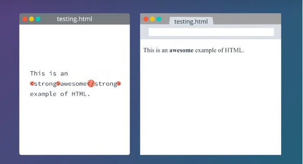

It has these *less than and greater than* *signs* that set off the name of a ***keyword*** such as strong. *This word strong* inside these symbols is a ***tag***, and this whole unit with *two matching tags* and *some text in between is called an **element***. Here is another example of an element.

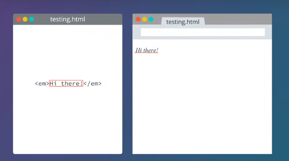

This one is called an ***em*** element; an ***em*** stands for ***emphasis***. It means that the text inside should be emphasized. Usually that means it is displayed in italics. Whatever contents are inside the element like, hi there, will be displayed that way in the browser.

Now, every element *starts and ends with a **tag***. The one at the beginning has a *less-than sign*, em, and then a *greater-than sign*, and at the end of the element there is a tag with a *less-than sign, **slash**, em, and a greater-than sign.* The difference between these two tags is the *slash* in this one. The way HTML works, this first tag is called an *opening tag or starts tag*, and the one with the slash is a *closing tag or end tag*, these often come in pairs like this, but not always.  

The HTML tags always start with the less-than sign and end with the greater-than sign. Web programmers usually call these ***angle brackets*** because they are shaped like a sharp angle. The angle brackets always come in pairs, it\'s an error to start a tag with an open angle bracket and not ever write a closed bracket to finish the tag. This idea of opening and closing is going to keep coming up as you learn HTML and in other computer languages too.  

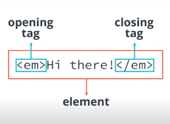

Now, you might notice that I call this whole thing an element, and I call these start and end parts tags. That is technically correct. However human beings are not always as precise as computers are, and so you will often hear us *talk about this whole thing as a tag*. That is a little bit wrong, but you will generally be able to tell from context, whether we are talking about a single opening or closing tag, or a whole element.

***
## **Breaks and Empty Elements**

**Whitespace** includes spaces, tabs, and line breaks. When the browser displays an HTML file, it treats a run of whitespace as a single space character. In order to create a line break that will show up in the browser, use the \<br\> tag.

BR stands for break. As in line break. Start a new line. When we reload the browser window, there, the poem shows up correctly. Now, you might notice that there is ***no closing tag for the BR element***. That is because it does not have any contents. There is nothing inside a line break. It is just saying, break the line here.

We will see a few more HTML elements like this later. Ones that do not have a closing tag at all, because they do not have any contents. Elements like this are called ***void elements, or empty elements***. One other example of these is the *IMG tag for images*.  

***
## **Paragraphs**

To make a paragraph in html, we use the ***P element***, P stands for *paragraph,* and it is a regular tag. There is an opening P tag with an angle bracket P, angle bracket, and then there is a closing P tag with an angle bracket slash P, angle bracket.

    \<p\>paragraph\</p\>

Each paragraph will be separated from the next one by a little margin. Whenever you are writing texts for a webpage in html, you will use P elements to mark up all your paragraphs.

### ***Why not just use line breaks?*** 
It turns out later that there are good reasons to tell the browser about the structure of our text*, the little pieces it is made up of* and *not* just *what we want it to visually look like*. You will learn more about this ***later*** when you learn to control the visual appearance separately using CSS.

As a rule, though, it\'s good to \"tell the truth\" in your HTML code: if a piece of text *is* a paragraph, you should *call it* a paragraph; and the way to do that is with *a p element*.  

***
## **Lots of elements**

### **Mark**

The \<mark\> tag defines text that should be marked or highlighted.

### **Sub and Sup**

\<sub\> and \<sup\> stand for \"*subscript*\" and \"*superscript*\". Originally, HTML started out as a tool for scientific and academic work; and these are useful for science and math, like writing x2+3x+4 = 1 or chemical formulas like H2O.

A **subscript** or **superscript** is a character that is set slightly below or above the normal line of type, respectively.  

***
## **Nested Elements**

Elements on an HTML page can go inside other elements, this is called Nesting. But they must follow some certain rules when they do.  

For example, you can have a paragraph element that has *em* or *mark* elements inside it. In fact, that\'s how HTML documents normally work. The top-level elements in the document are things like paragraphs and other big divisions, and inside those, are smaller elements like, \"Emphasize this text,\" Or \"Highlight that text.\"  

Any of these smaller elements, can be put inside another one too. For instance, you can have text that is both emphasized and highlighted, or you can have things like superscripts show up inside of a piece of emphasized text. But there are some combinations that do not work, ***you cannot put a paragraph inside another paragraph*** for instance, and ***two different HTML elements, cannot overlap in the text***. One must be entirely inside the other.  

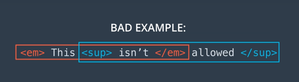

Either the *sup* needs to be inside the *em*, or the *em* inside the *sup*. These rules are mostly common sense, but we will point them out when there are unusually specific requirements. Either element can go inside the bigger one, but you have to decide which one will go inside, they can\'t overlap.

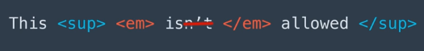

Nice and symmetrical.
***

## **HTML Elements Review \#1**

-   \<em\> and \<strong\> --- Emphasis.

By default, text inside \<em\> is displayed as italic, and text in \<strong\> is displayed as boldface.

-   \<p\> --- Paragraph.

Text in a paragraph is separated visually from other paragraphs by a small margin.

-   \<br\> --- Line break. (empty)

A line break does not create a new paragraph; it only marks the end of a line.

-   \<sub\> and \<sup\> --- Superscript and subscript.

Useful for math and chemistry: I have x**3**+2x2 and molecules of H**2**O.

-   \<mark\> --- Highlighting.

Not very often used, but it's <mark>kind of cool</mark>.

Of these elements, the br element is the only one that is an *empty (or void)* element.

### **An Excerpt from the next part:**

HTML has several elements for headlines or section headings, starting with \<h1\> for the largest headlines and going down to \<h6\> for the smallest.  

***
## **Headings**

The h1 element can be used for **headlines**, or **section headings**. There are actually six of these heading elements: h1 through h6.

h1 is used for the main heading on a page, while the rest are used for sub-headings.

**Note:** You may have noticed that you do not actually *have* to use the p element. But like we mentioned earlier, it\'s a good idea to tell the browser what kind of content something is---by enclosing those paragraphs inside p elements, this is indicating that the contents are paragraphs of text. We will explain more about *why* this matters in the next lesson, when you learn about something called CSS.  

***
## **Block and Inline**

### **Block-level Elements**

A block-level element always *starts on a new line*.

A block-level element *always* *takes up the full width available* (stretches out to the left and right as far as it can).

A block level element has *a top and a bottom margin*, whereas an inline element does not.

p is a **block element**, which means the browser creates a box around it. It also generates a margin around this box, to visually separate the paragraph from surrounding elements.

### **Inline Elements**

An inline element *does not start on a new line*.

An inline element *only takes up as much width as necessary*.

The elements that *do not create a block* like em and mark and even br, are called inline elements.

br is an **inline** element that just creates a line break. It does not have a box around it and doesn\'t create any margin.

***Examples***

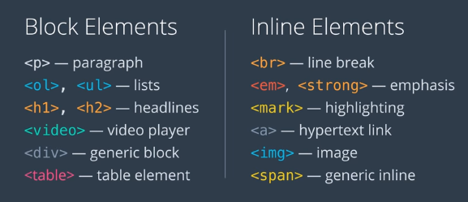

Things like lists, tables, headlines, and video players are all ***block elements***. The browser makes a box for each of them. If you put a *numbered list* into your web page, the browser must put a box around it.

But things like line breaks, emphasis, links to other web pages, and images are all inline elements, they do not make a box, *they just flow with the texts that they are used in.*

***

## **The *div* element**

The div is short for **division**, because that is what this element is for---you can use it to *divide* up the page into different sections.

Like the paragraph p element, the division div element has an invisible box around it---and just like p, it can have *a border, a margin, a width, a height, and so on*.

But a p element is specifically meant to contain text. In contrast, the div element is **a *generic* container** for *whatever other elements* you might want to put inside. You can use the div element to *organize the content and divide the page into sections*.

The div element is a super important one, and it is used a *lot* in HTML *to help lay out and organize pages.*  

***
## **Lists and Implied Close Tags**

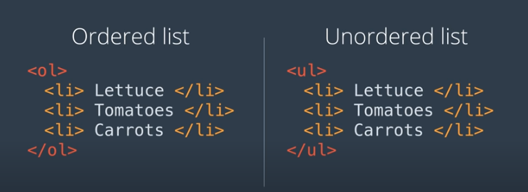

The \<li\> element *cannot exist on its own* but must be nested within an ordered list (\<ol\>\</ol\>) or an unordered list (\<ul\>\</ul\>) as shown in example above.

 The default display of an unordered list (ul) uses *bullet points*. The default display of an ordered list (ol) *uses numbers*.

So, why can\'t a list item stand on its own outside of a list? Well, an ol list and a ul list are displayed differently. Without the context of one or the other kind of list, the browser would not know whether to put a dot or a number on the item. Because of that, HTML has a rule that li elements can only occur inside either an ol or a ul. But *lists can be nested inside other lists*.

Because an li element can only occur inside a list and it cannot occur directly inside another li, *HTML doesn\'t actually require us to write closing tags* for li elements. The reason this works is *the* li *element can never occur directly inside another* li, it always must be inside an ol or ul. Which means, if the browser is reading the text of an li element and it encounters another li opening tag, it knows the previous list item must be done with.

So, you can choose to write closing tags for li if you want to or not. Some web developers always do because they think it makes their code clearer. Some do not because leaving them out saves a little tiny bit of space in the file, it\'s up to you. But you always need to write closing tags for ul and ol, so the browser doesn\'t try to stuff everything after them into the list

The em, ul, and ol elements require a close tag, but the p and li elements do not.

The br tag is a void element, so it does not allow a closing tag.  

***
## **Nested lists**

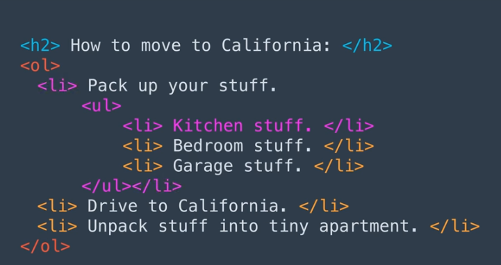  

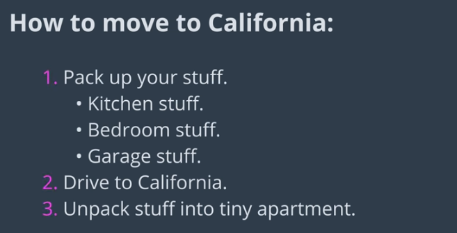

A nested list or a sublist is a list within a list. The trick to marking nested lists up correctly in HTML is to recognize that the sublist is actually a child of a list item and not of a list.

1.  Start by creating a list. It can be ordered or unordered:

> \<ul\>
>
> \<li\>Fruit\</li\>
>
> \<li\>Vegetables\</li\>
>
> \<li\>Meat\</li\>
>
> \</ul\>

2.  Now add a nested list to the first list item:

> \<ul\>
>
> \<li\>Fruit
>
> \<ul\>
>
> \<li\>Bananas\</li\>
>
> \<li\>Apples\</li\>
>
> \<li\>Pears\</li\>
>
> \</ul\>
>
> \</li\>
>
> \<li\>Vegetables\</li\>
>
> \<li\>Meat\</li\>
>
> \</ul\>

Notice that the sublist is a child and not a sibling of an \<li\> tag.  

***
## **Indentation**

You may have noticed that code editors sometimes try to help you out with your indentation. For example, when you hit the *enter* key, editors will sometimes insert an indent at the beginning of the new line.

Usually this default indentation is good, but sometimes it goes wrong. For example, when you leave off the optional closing tag on a list item li, many code editors will indent to the right because they think you are wanting to nest something *inside* that li. That can lead to patterns like this:

    <ul>

        <li>Yikes!

        <li>This

        <li>keeps

        <li>indenting

        <li>to the right!

    </ul>

When that happens, you may have to manually delete some of the extra indentation to clean things up.

### **Best method: indent text/content**

    

        Lorem ipsum dolor sit amet, consectetur adipisicing elit, sed do eiusmod tempor

        incididunt ut labore et dolore magna aliqua. Ut enim ad minim veniam, quis nostrud

        exercitation ullamco laboris nisi ut aliquip ex ea commodo consequat.

    

### **Advantages:**

-   Start (\<p\>) & end (\</p\>) are at same level, so it\'s easy to see that you\'ve closed code & also see where code starts & ends.

-   Easy to differentiate between code & text/content.

### ***Block-level elements***

    
 
        Lorem ipsum. 
    

***
    
 
        Lorem ipsum 
         Dolor sit amet 
    

***
    <blockquote> 
        
 
            Lorem ipsum dolor sit amet, consectetur adipisicing elit, sed do eiusmod tempor incididunt
            ut labore et dolore magna aliqua. 
        
 
    </blockquote>
**Note:** Notice how text/content is indented inside \<p\>, and then \<p\> is indented inside \<blockquote\>. This is called nesting. See how easy it is to tell what is a child of what?

    <table> 
        <tr> 
            <td> 
                Lorem ipsum dolor sit amet 
            </td> 
            <td> 
                Consectetur adipisicing 
            </td> 
        </tr> 
        <tr> 
            <td> 
                Lorem ipsum dolor sit amet 
            </td> 
            <td> 
                Consectetur adipisicing 
            </td> 
        </tr> 
    </table>
Note: Again with the multiple levels of indenting---but it should be obvious how much it helps reading that code!

#### **Exceptions**

-   We do not indent \<h1\> & other headers because they are short, but if you want to indent \<h\#\>, that would be fine*.*

-   We do not indent \<title\> & most other items inside \<head\> because they\'re short.

-   We do not indent \<li\> because most of the time the contents are short, because we\'re more concerned about the \<ul\> & \</ul\>, & because it can really lengthen the overall code. That said, if you want to indent \<li\>, feel free.

### ***Inline elements***

You never indent inline elements. Treat them like text/content. Examples:

    
 
        Lorem ipsum <strong>dolor sit amet</strong>, consectetur adipisicing elit, 
        sed do <em>eiusmod tempor</em> incididunt ut labore et <code>dolore 
        magna aliqua</code>. Ut enim ad minim veniam, quis 
        nostrud exercitation ullamco <a href="http://www.demonoid.me">laboris
        nisi ut aliquip</a> ex ea commodo consequat. 
    

### ***What about the basic structure of a webpage?***

    <html>
    <head>
        <title>Document title</title>
    </head>
    <body>
        <h1>Page title</h1>
        

            Lorem ipsum dolor sit amet, consectetur adipisicing elit, sed do eiusmod tempor incididunt
        

    </body>
    </html>

### *So why aren\'t \<head\> & \<body\> indented? A couple of reasons:*

-   You know that \<head\> & \<body\> are the children of \<html\>; in fact, they are *always* the *only* children of \<html\>, so there is no need to remind yourself of this via nesting.

-   You save yourself one level on indentation; when you start nesting HTML inside HTML inside HTML inside HTML, this can add up.

***Additional Resources:***

<https://www.granneman.com/webdev/coding/formatting-and-indenting-your-html>  

***
## **Web addresses**

A web address is called a ***Uniform Resource Locator***, or ***URL*** for short. That just means that it is an address that *tells your browser how to locate a particular resource, a file for instance, in a standardized way.* The word uniform here just means that it is consistent.  

There are lots of different ways that URLs are written when people are going to read them. Like sometimes you will see them *with http or https on the front*, and sometimes you will not. Like on the side of a truck, someone might put www.ourcompany.com. That works fine if you type it into a browser, because *the browser guesses that you want to go to a website*. But if you use that in HTML code*, it will not work*. *The browser thinks that you are referring to a file with that name.* When we write URLs in html we need to be pretty careful to give the browser all the information that it needs.

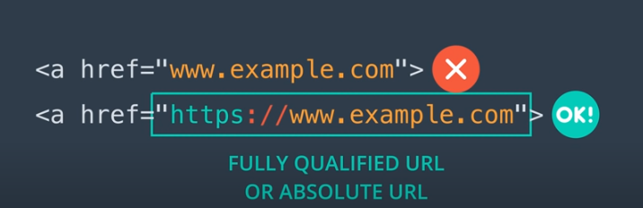

At the beginning web URLs start with http or https. This tells the browser whether to use secure encryption to connect to a web server. The URL for a file that is on your local drive will start with \"file\" instead. http, https, and file are all *protocols, or ways that the browser can get something*.

After the protocol, we always see a *colon, slash, slash*, what separates the protocol from the next part. For web URLs, the next part that you will see is a *domain name*. This *tells the browser what server to connect to.* File URLs will not have this because *there is no server*. It is just the browser reading off your own computer. That is why if you give a file URL to someone else, they probably will not be able to see it. It is because the same file is not on their computer.

The last thing that appears in a full URL is *a file path*, *the name of the directory*, and *the file that the URL is referring to*. This will sometimes be *empty or a single slash* if you are linking to the top page or *homepage of a site.* And often this slash will be omitted altogether, this would still be considered a fully-qualified URL.

In contrast, if we look at the URL for a file on your local system, we must give the file path---in fact, most of the URL is the file path:

    file://Users/Kelly/notes.html

If we took away the file path from the above, we would just have:

    file://

Which is definitely *not a fully qualified URL*.

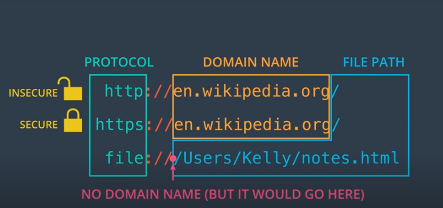  

***
## **Links and the \<a\> tag**

The web is built on the idea of hypertext. Hypertext means that you can have *textual documents*, like web pages, but that *they also have references between them*. On the web, those are ***links***.

When you write HTML, you can link to other web pages, both your own and someone else\'s. That is how a search engine works, for example. So, here is how to make a link in your own HTML. The element for making links is called \<a\>. That stands for anchor, because an element anchors an address to a piece of text on the page.

But we cannot just use by itself. There are a couple things we need an element to include to make a link. The *text that a user clicks on* to follow the link, *and the URL of the page we are linking to*.

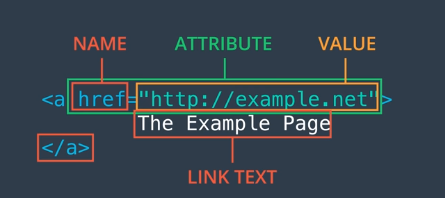  

Here is how we are going to do that. The opening tag for the element has this extra little bit in it that we have not seen in HTML tags before. This href equals \"a url\" part. This is an example of an ***HTML attribute***. It is an *extra piece of data that comes along with the element, and it gives it extra meaning*. The part *before the equal sign is the name of the attribute*, and *the part after, in double quotes, is the value of the attribute*. Here, the name is href and the value is http://example.net. The name href stands for *hypertext reference*, and it is used *with tags and a few other tags that link to another document*. You will *not* ever see it *on a paragraph* or *an emphasis* *tag* or something else.  

Then, there is the *contents of the element*, which becomes *the text that appears on the page*. Then there is the *closing tag*. You might notice that it does not have any attributes in it. Attributes like href always only go in the opening tag at the beginning of an element. That is pretty much all there is to making links in HTML.  

You have just made an element with *a start and an end tag*. The start tag has an *href attribute* with *an equal sign*, and *in double-quotes, the url of the page that we want to link to*. The *contents of the element* become *the text the user clicks on*, and then there is a *closing tag*.  

You can sometimes click on an item and have it launch in a new browser tab. If you want to do this in your own links, you can add the attribute target=\"\_blank\" to the a element. Like this:

    <a href="https://example.com "target=\"_blank\">Example</a\>

The a element is an **inline** element. It does not create a box on the page. Links normally have the appearance of a specially highlighted piece of text.

### **Practice --- Addresses and links**

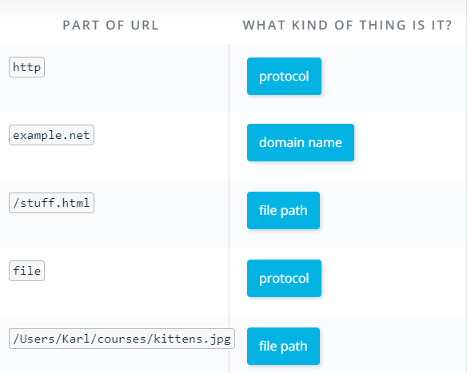

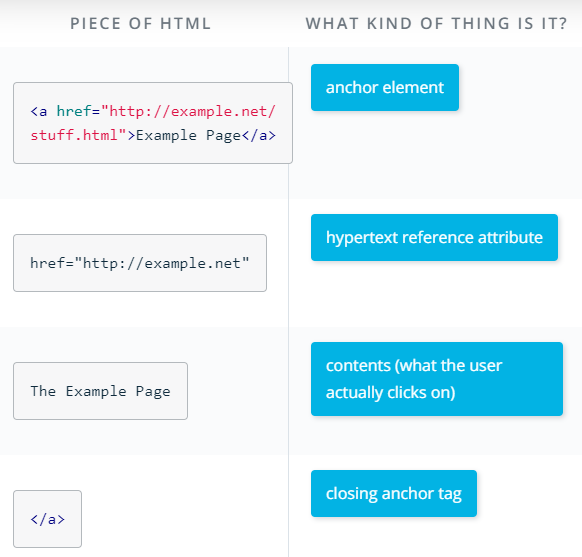

***Reminder***: We need to have the https protocol, as well as the :// separator, in order to make a working link! (for it to match the requirements for a fully qualified URL.  

***
## **Adding images**

Images are a huge part of why the web is so successful. So, you might be wondering how to include images in your own web pages. There is an HTML element for just that. This element is img for ***image***, and works a lot like the a element for links but with *some important differences.*

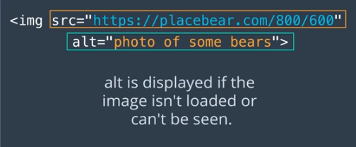  

Now, the a element for links uses *a single* attribute named href whose value is the URL of the page you want to link to. But the img element uses *two* attributes: src and alt. Now src stands for *source* and it is the *URL of the image* that you want to appear in your webpage. An alt stands for *alternate,* and it is *a text description of that image*. The text that shows up here is usually called the alt text.

Now, you *need* to include both of those attributes when you write HTML. The src attribute is there to tell the browser where to get the image from, what is the source of the image. The alt attribute is there to tell the browser what text to show if it cannot display the image. For instance, alt text will be displayed if the *file is missing from the server* or if *the user\'s network connections stop working* before that image can be loaded which is common on mobile for instance. Or if the user cannot see images, for instance, if *they are blind*.

Something to keep in mind; putting an img element into your HTML file *does not copy the image file* into your HTML file. It just *tells the browser where to find that image file*, what the source of it is. The image file still must be somewhere, whether that is on your local disk or on a server. The img element is *an empty or void element* like br. It does *not have any textual contents and there is no close tag for it.* Remember, contents of an HTML element would be text between an open and a close tag like in a p element. In the sense that we are using here, the src and the alt on an image tag *are not contents*, they are *HTML attributes* of that element.

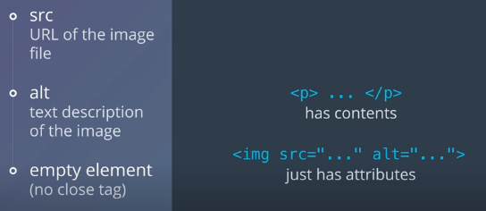  

The img element is an inline element. You can put an image right into the middle of a piece of text. If the image is taller than the text around it, it will space the lines of text out.

To create *an image that is a link*, put an img element between the open and close tags of an a element, for instance:

    
This is a great example of nesting!

**\
Files and relative URLs**

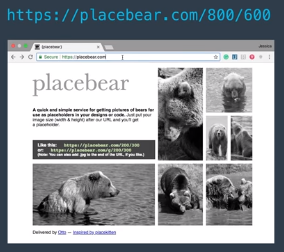

You might have noticed this Image URL earlier. It is from a site called placebear.com, which has a lot of images of bears. If you want a picture of a bear of a particular size, say 800 by 600 pixels, placebear.com will find one for you. To put this image into my notes.html file, I\'ll put it in an *IMG tag*, and when my browser opens this HTML file, it\'ll know to go out to the placebear.com server, and fetch that image, and put it into the page.  

But what if I have an image file right here on my own computer? In fact, what if it is sitting in the *same folder as my HTML file*? Do I have to put it on a server someplace to refer to it by an image tag? As it turns out, I do not. Instead, I can *just put the file name in the image tag*. Now why does that work? Well, the browser looks at the SRC attribute here and it does *not* see *a full URL*. It does *not start with http:// or file://* or something like that. Specifically, there is *no :// anywhere in it*, and the browser has a rule for what to do when that happens in an HTML document. Specifically, it looks for this file name as a variation of the HTML document\'s own URL. This is called ***a relative URL***.  

Now, right now my HTML file is on my own computer, and the browser sees it with the URL: file:///Users/Karl/courses/notes.html. So, when this file refers to the *relative URL kittens.jpg*, it will look for that *file in the same directory*. Even though I only had to write and kittens.jpg in my HTML file, the browser will load the same URL as *file:///Users/Carl/courses/kittens.jpg*.  

Using the relative URL has a lot less typing, but that is not the only advantage of it. If I wanted to send this Web page to someone else, well, the HTML itself does not contain that kitten image file. I need to send them the image file too. But, if I send this file to Kelly, it is sure not going to show up on her computer in a directory called */Users/Karl*. If I have URLs in my HTML, that point to directory is on my computer, and they are *not going to work on someone else\'s computer*.

So, as a rule, if you are referring to an image or a link that\'s on a Web server, like placebear.com, you\'ll usually want to use a full URL like https://placebear.com/800/600. But, if you are referring to an image or another file that you are passing around along with your HTML file, you should use relative URLs.

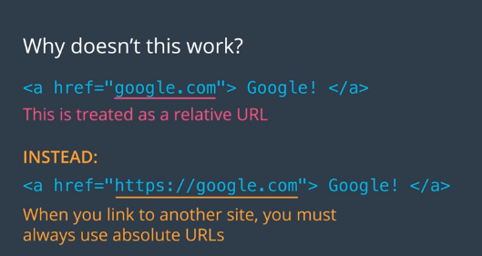

By the way, relative URLs are the real reason that you can\'t make an a link to Google by just writing, a href = google.com in your HTML, even though Google.com works if you type it directly into your browser. In HTML, a URL with *no ://* in it is always *treated as a relative URL*. So the browser would look for *a file called Google.com* which is usually not what you want. So, if you want to make a link to another site, you must put the http or https on the front.

Remember, attributes always go inside the *start* tag of an HTML element.  

***
## **HTML elements review 2**

Now you have learned about many more HTML elements! This page is a summary of all the elements you have seen so far. You can use this page as a reference if you forget how to use one of these elements in your code.

### **Block elements**

Block elements are used for large sections of text, such as paragraphs, headlines, or lists; and also for some other features such as video players and tables.

A block element creates a (usually invisible) box in the browser display. By default, this box takes up the full width of the display. The beginning of a block always starts on a new line in the display.

Most block elements have a particular way they are displayed by default: paragraphs have margins around them; lists have bullet-points or numbered items; headlines are printed in large text. There is also a generic block element, div, which has no special defaults.

-   p --- Paragraph.\
    Text in a paragraph is separated visually from other paragraphs by a small margin.

-   ul and ol --- Unordered and ordered lists.\
    By default, ul lists are displayed with bullet points, and ol lists with numbered items.

-   li --- List items inside a ul or ol list.\
    The li element has to be nested inside a ul or ol list; it can\'t occur on its own.

-   Section headers, from h1 (largest) to h6 (smallest).\
    Used for headlines, section titles, and the like.

-   div --- A logical *div*ision of a page or document.\
    Other block elements such as paragraphs, lists, and headers can be nested inside a div.

You will see the div element much more in the next lesson. Because they don\'t have any default display settings, divs *are heavily used with custom styling with CSS.*

### **Inline elements**

Inline elements do not create a full-width box on the display. They modify the display of text, or insert other things into the text --- such as line breaks, images, or hyperlinks.

-   em and strong --- Emphasis.\
    By default, text inside an em is displayed as *italic*, and text in strong is displayed as **boldface.**

-   br --- Line break. *(empty)*\
    A line break does not create a new paragraph; it only marks the end of a line.

-   sub and sup --- Subscript and superscript.\
    Useful for math and chemistry: I have x^3^+2x^2^ molecules of H~2~O.

-   mark --- Highlighting.\
    Not very often used, but it is kind of cool.

Some of the inline elements you have seen require **attributes**, extra information besides the name of the element itself. Attributes are written inside the opening tag of the element.

-   img --- Images.\
    Needs a src attribute with a URL, and an alt attribute with descriptive text.

-   a --- Hyperlinks.\
    Needs an href attribute with a URL.  

### **Images**

The syntax for the img tag is like this:

    

The URL of an image may be an *absolute* URL, such as http://placebear.com/800/600, or it may be a *relative* URL such as images/wolves.jpg.

The alt text is used if the image can\'t be loaded, or if the user can\'t see images --- such as if the user is using a [**screen reader**](https://en.wikipedia.org/wiki/Screen_reader).

**Links**

Hyperlinks allow the user to navigate from one page to another. They are created using the a element. The destination of the link is written in an attribute called *href*; the link text appears as the contents of the a element. Here is an example:

    <a href="https://en.wikipedia.org/wiki/Hypertext">
    Wikipedia's "Hypertext" article
    </a>

This code produces a link like this: [**Wikipedia\'s \"Hypertext\" article**](https://en.wikipedia.org/wiki/Hypertext).

A link within a single web site can be written using a relative URL. Links to other sites must be written as absolute URLs.  

***
## **Documents: The DOCTYPE tag**  

So far the HTML that you\'ve been writing in this lesson has been what are called *HTML fragments*. They are snippets of HTML. Which your browser can display, but there are few more things to add to make them into a full HTML document, which is to say a web page. There are couple of things you will need to add to every HTML document to make it complete.

First, how does the browser know what kind of document it is? The *file name extension* only tells *part* of that story. HTML has been around for many years, and there have been a lot of different versions of HTML. We indicate what kind of HTML we are using, by putting a special tag at the very top of the file. This tag is ***the DOCTYPE tag***. It is written a little differently from other tags.

In earlier versions of HTML, these DOCTYPE tags became very long and convoluted. Eventually, the engineers who design HTML decided to simplify them down to the very basics. In modern HTML, the DOCTYPE tag looks just like this.

    <!DOCTYPE html>

Just like that. You will put this, exactly this, at the top of every HTML document you write. Now *what does the DOCTYPE tag do?* It tells the browser that we are intending this document to be treated as *modern HTML*, as opposed to one of those older versions. This isn\'t a very big deal for simple HTML but it prevents a lot of bugs when your HTML gets more complex. Without the DOCTYPE tag, browsers will go into what is called *quirks mode*. Which is *trying to be more compatible with older forms of HTML*. That is generally not something we want today. So, putting the DOCTYPE tag on your documents is the right way to go.

***
## **Head and body**

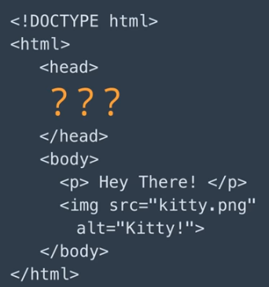

A full HTML document has two parts. Everything you have seen so far in this lesson except the DOCTYPE Tag, *lives in the second of these parts*, the ***body*** of the document, that is where the *contents of the document go*, *the paragraphs, images, lists, links* and *other things that will appear on the screen for the user*.  

The other part of an HTML document is called the ***head*** and it is where we put certain pieces of important information about the document. Both the head and the body occur inside *a single enclosing element* called *HTML*.  

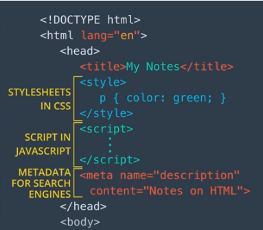

Here is just a few of the things that can appear in the head of an HTML file. The ***title*** is the only *required* part of the head. It tells the browser *what title to put on a tab* that is displaying the document. We put the title in a title element with *an open and a close tag*. 

Another thing that shows up in the head is ***style** sheet information*. You will learn a lot more about this later. Style sheets tell the browser things like what *fonts* and *colors* to use on the page, and how to *position the text*.

The head can also contain ***scripts*** which are programs that run in the browser. This is *how* *front-end web apps work*, like the quizzes you have seen in this course for instance.

The head can also include ***metadata*** which is other information about the page itself such as *keywords for search engines*.

There\'s also information that can go *on the HTML tag itself,* for instance, this is where you can say *what **language** your document is written* in, not the computer language, that\'s HTML, but the *human language* such as English or French or Tibetan or Swahili. This is *helpful* for programs that try to understand or pronounce the contents of that document such as *screen readers* for visually impaired users. For now, the only element of the head that you need to use is the ***title*** tag because it is required in HTML documents. The others you will use later as you learn more about the web.

## **Are head and body required?**

In one sense, **no**, but in another sense, **yes.**

The grammar of HTML does not require that you *literally* write a \<head\> or \<body\> tag in your HTML code. Many web developers do write these. However, if you *do not*, the browser will attempt to place them into your code itself.

It needs to put the head element around certain elements that belong there, such as title; and to put the body element around the elements that form the document\'s body. This means that all the head elements must appear first, and the body elements after.

You cannot have a head element, such as title, in the middle of your document:

    <h1>Here is a 😨 problem:</h1>

    
This is a paragraph, which has to be part of the body.

    <title>This is the title, which has to be part of the head.</title>

    
The title is ❗️not allowed ❗️ to be in the middle of the body!

So even if you choose not to literally write the \<head\> and \<body\> *tags* in your document, the head and body *elements* are still created by the browser; and the rest of the document needs to be consistent with this. But you must make sure that the title and other head parts appear before any paragraphs, lists, images, or other body parts.

*You might see older HTML documentation that says these tags are required. This was true in XHTML, an older version of HTML. Today\'s browsers use HTML5, which does not require them.*  

***
## **Validating HTML**

In this lesson, you have learned a lot of rules for how to write html. These rules are like the spelling and grammar rules of a language, but how can you be sure that your html is spelled correctly, and written grammatically?

For starters, you can *load it up in the browser*. If it looks right in your browser, it must be okay, right? Not quite, *it might have a mistake that your browser can deal with*, but *some other browsers cannot.* It is hard enough to make browsers work the same on correct html, and it would be a lot of work to test your html on every browser out there. Fortunately, there\'s a way to check your html, to make sure the syntax is right. There are tools called *HTML validators*, that will check for all the details. Everything from tags being spelled correctly, to some of those tricky nesting rules, like list items must be inside a list.

The best-known HTML validator is [validator.w3.org/](https://validator.w3.org/), which is run by the *W3C*, ***the World Wide Web Consortium***. That is the *organization* that *writes the standards for html*, and *other* components of the web. So, they are in a pretty good position to tell you if your html is right.

There are three different ways you can use the validator service. If your html is on a public web server, you can just *give the URL* and it will download and check the html. But if you are working on an html file on your own computer, you will want to use one of the two other options. You can *upload the file,* *or you can copy it from your editor and paste it in.*

When you do, you will get a little report like this, that tells you whether there are errors in your html. If there are errors, you will get a message like this, "element head is missing a required instance of child element title". That is a technical way of saying, \'\'A full html document needs to have a title element which goes into the head element.\'\'

When you get errors like this, fix them in your text editor, then paste or upload the new version and check it again. When it is all correct, you will get *a nice green message*, *saying there were no errors or warnings to show.*

**The validator is stricter**

Web browsers are very *lenient* about how they interpret HTML. They work around small errors and omissions. The quizzes you have seen in this lesson have been relatively lenient as well. The HTML validator is intentionally *stricter* than actual browsers.

For instance, if you write an img element with *no alt attribute*, *a typical browser will display it just fine*. But the language requires the alt attribute to provide a textual description of an image; this *helps search engines* and *users with visual disabilities*. By reporting a missing alt attribute as an error, the validator makes sure that *valid* *HTML will be more accessible*.

**\... but it can\'t catch everything**

The validator cannot tell whether you gave your document a *good* title. It cannot tell whether the alt attribute contains an *accurate* description of the image. The validator will not notice if you wrote \<html lang=\"de\"\> (saying that your document is in German) on a document that is written in Korean. It is still up to you to make sure that your HTML says what you mean it to say.

**But what does it mean?!**

You will definitely sometimes run into validation errors that you don\'t understand. This is a normal part of being a programmer, so it is important to develop skills for working through them!

When you do see an error that you are not sure about, here are a few things you can try:

-   Copy and paste the error into your favorite **search engine**.

-   Search **Knowledge** to see if someone has previously encountered this error. If they have not, you can post a question about it yourself!
