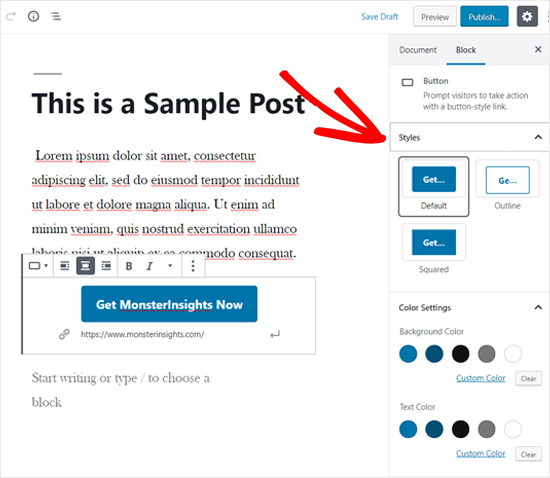
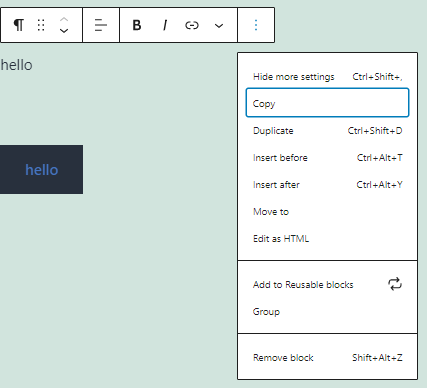
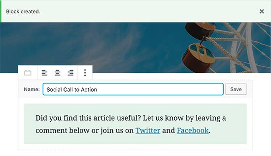

# WordPress
## What is WordPress

WordPress is a CMS (***Content management systems***) ,it is also a web publishing platform.

It was first started in 2003 and since then it has become one of the most popular websites launching application in the world. It powers 30% of the web.

The goal of WordPress is to make publishing *accessible* *to everyone*. What is more is that it's also *free* and *open source* (meaning it can be used for creating anything from blogs to e-commerce webstore to whatever you want).

**Features:**

-   Thousands of themes that you can choose from

-   You can tweak and change most components

-   Available in 180 languages

At its base it acts as an ***interface*** between *you*, the *database*, and your visitors making it easier for you to create content and control how you want to present it for your audience.

## wordpress.com vs wordpress.org

### Wordpress :

-   Free and open source [**application**](https://wordpress.org/download/)

-   Can be used to develop your own websites using the application development environment

-   a correct use of the term would be \" my recent website is powered by wordpress\"

### Wordpress.com :

-   Is a SaaS (software as a service)

-   Can be used to publish your website through the platform

-   Can\'t upload plugins

-   Limited customizable themes

-   Private domain name not available

-   a correct use of the term would be \" i created my first blog using wordpress.com\"

### Wordpress.org:

-   The website where the wordpress application is [**hosted**](https://wordpress.org/)

-   Documentation is found [**here**](https://wordpress.org/support/)

-   Access to thousands of plugins

-   Ability to have your own domain name

-   Ability to monetize your website through Ad placements

## How it works

**WordPress**

-   is used to publish content on the web

-   acts as an interface between the publisher, the database and the visitor

-   is used to publish content on the web

-   content is stored as database entries

-   elements accessed through URL

-   page displayed after retrieval from database

What's great about this is that in reality*, there are no webpage created* when you use WordPress to publish content .There are *only database entries created by you* and when the user visits the URL. a *page is created and displayed for them by the WordPress application.*

WordPress does what we call separation of concerns, giving you the outmost control for every detail on your website.

## Installing WordPress

### Wordpress Installation :

-   a good option would be to install [**MAMP**](https://www.mamp.info/en/downloads/) to be able to run and install wordpress locally

-   you can checkout this [**video**](https://youtu.be/B3JznjvVvMg) which includes instructions on how to install wordpress using MAMP on your local computer

-   use this [**link**](https://wordpress.org/support/article/how-to-install-wordpress/) from the official wordpress documentation on how to proceed with the installation process

### Admin Panel

you can use the admin panel to do what?

-   publish content

-   create content

-   edit content

-   change website appearance

## Content Types

**posts and pages are a collection of?**

-   images

-   videos

-   text

**where are media elements stored?**

In the database

### Posts and pages**

**you choose a page if?**

-   There is a parent-child relationship

-   It us a standalone item

-   Topics are included in the main menu

-   Content is not likely to change a lot

**You choose a post if?**

-   It is part of a stream of content

-   Content is time sensitive

-   Content is related to a specific event

### In other words

#### Posts:

1.  Good for info that is time-based

2.  2-Content is time-sensitive (Has a publish date, related to the specific event..)

3.  3-Author, Catagory &tags.

 #### Pages:

 1. Content stands alone

 2. Parent/Child page relationships

 3. No authors, Categories, or Tags

 4. Good for publishing info that doesn\'t require change too much like a company's about section

 5. Topic is included in the navigation menu.

## Managing content

### View types:

-   Posts & Pages index

-   Posts & Pages editor

-   media library

### The index contains information such as :

-   Author

-   Categories

-   Tags

-   Comments

-   Publishing date

Incomplete content falls under which tab in the posts and pages index? Draft

What about published ones? Published

What about deleted ones? Trash

## Creating content

***Blocks*** are content elements that you add to the edit screen to create content layouts. Each item you add to your post or page is a block.

You can add blocks for each paragraph, images, videos, galleries, audio, lists, and more. (such as headings)

Examples from the block library:

There are blocks *for all common content elements* and more can be added by *WordPress plugins*.

The block editor is designed to be intuitive and flexible.

There is also a visual editor option which you get by default with a UI like that of a word processor and a code editor where you can customize the post to your heart's desires.

In the ellipsis at the top right corner there are additional settings for how the View is displayed such as

-   Top toolbar:

> For setting where you can access all block and text tools whether at the *top* or above each highlighted block (when unchecked)

-   Spotlight mode:

> Focus on one block at a time (greys out all currently unused blocks)

-   Full Screen mode

> Removes the side menu for WordPress

While it looks different than the old WordPress editor, it still does all the things that you were able to do in the classic editor.

***What does the \"i\" icon content structure show?***

-   words count

-   headings count

-   paragraphs count

-   blocks count

## Creating Links

To add a hyperlink, highlight the text that you want to attach the link to. This selected text is called the anchor text for the link. Now click on the 'Link' button:

You'll see a box where you can enter a URL. A URL is a web address. For instance, WPBeginner's [guide on how to start a WordPress blog](https://www.wpbeginner.com/start-a-wordpress-blog/) has the URL *https://www.wpbeginner.com/start-a-wordpress-blog*.

You can simply copy and paste the URL of the post or page you want to link to, like this:

Click the Apply (Enter) button to insert the link into your post.

If you're linking to content on your own site, then it might be quicker to *search for it*. Type a word or two *from* *your content title*, and WordPress will find it:

Click on the title of the page or post you want to link to, and the URL will be automatically added for you. Again, you'll need to click the Apply button to put the link into your post.

If you want to set your link to open in a new tab, then click the arrow on the right. You can then click the toggle and set your link to open in a new tab.

**Note:**

-   -We recommend that you only use this option for links to third-party websites. This way your users don't leave your website while visiting it.

-   To exit a highlighted text simply press the right arrow key twice.

[Source](https://www.wpbeginner.com/beginners-guide/beginners-guide-on-how-to-add-a-link-in-wordpress/)

## Creating Buttons
On your post edit screen, *click on the '+' icon* to add a New Block *and select the Button block* under the Layout Elements section.

Next, you should be able to see the button block added to the content editor

Simply *click on the 'Add text...' area and enter your button text*.

After that, you need to paste the URL of the page you want to link in the 'Paste URL or type to search' field below the button if it does not appear simply click on the link button

Once done, *click on the Apply icon.*

If you want to display the button in the center, then you can click on the Align Center icon in your block toolbar above.

Next, you can customize your button style, change background color, and change text color from the block settings panel on the right side.

There are three button styles you can choose from: default, outline, and squared. You can try each one by clicking on them and choose the one that looks best.

The Color Settings section includes five color variations for both button background and button text. Not only that, but you can also use a custom color of your choice by clicking on the Custom Color option.

Once you are happy with the button design, you can save your post or publish to see a live preview.

## Creating blocks

### How do you create a block?

By simply typing you are creating a new block of type paragraph

To remove what you just typed and delete the block you highlight the block and click backspace twice

You can also choose to focus on a certain block and then click on more options (by clicking on the ellipsis) and then choose to insert a block before or after the selected block

Once you have a new block you can choose a type by clicking on the "+" icon where you can get access to all the blocks you can create.

You can also choose where exactly you want to position it by using the toggles on the left side of the post or by simply dragging it.

## Publishing Content

You can save your post as a draft and in this case only you can see it none of your visitors have access to it. Once you're done making changes you can choose to preview it. And finally you can publish your content by clicking on the publish button on the top right side of the editor.

Before clicking Publish, give your new post a few tags and categories, you can also choose to set your visibility as either public, private, or password protected. You can also choose to publish now or set a publishing date.

## Updating content
### The status and visibility menu in the document context

The ***publish date*** set in the Post settings menu at the right can be modified however you want whether that is the past present or future.

You can also set something to publish later so as not to publish all the posts you wrote that day in one go.

The "***stick to the top of the blog***" checkbox allows you to pin one post at the top of the website where it stays there regardless of future posts.

The "**Pending review**" checkbox is used when you have authors who may not have publishing rights, they can then check this setting to allow an admin to review a post and publish it.

## Deleting content

To delete a post, go to your ***Posts*** menu in the dashboard, hover over the post that you want to remove and click on the trash button. However, when you do that the post is not actually deleted but instead it winds up in the ***Trash*** section. From there you have two options either you can restore the post or delete it permanently. If you choose to permanently delete that post then it will be removed from the database forever.

## Categories and Tags

Categories are the main organization system used by WordPress to group similar posts together.

Tags are optional and they can be used to signal looser connections between posts

All posts must have at least one category but can also have as many as you like. If you don't choose a category for your post, it will then be labelled as uncategorized which is not very useful.

To do so you can head to the toolbar at the right and from the post tab and select an existing category or create a new category.

Below categories you can find tags, you can choose to write tags in any way you want they don't have to be related to each other. You can basically use them to loosely relate content to other content that may be similar in context to add multiple tags make sure to separate each of them by a comma.

## The Block manager

Go to the top right corner, click on the menu and you'll see the block manager. What does the block manager do? It does exactly what you expect it to do it helps you decide which blocks you want to work with and which you want to exclude (by unchecking them).

**Note:** Disabling a block in the block manager does not affect any existing published posts, page, or block.

## Group Blocks

The group blocks allows you to put one or more blocks inside of another block and then treat them as one block

To add a *group block*, click on the ***Block Inserter*** icon.

You can also type /group and hit enter in a new paragraph block to add one quickly.

Highlighting two or more existing blocks and choosing group from the menu.

***Benefits of using group blocks:***

-   Allows you to treat a group of blocks as one making it easier to apply the same changes to all of them in one go.

-   It also has its own properties: it can include any number of blocks and it doesn't change the layout of the included blocks it just views the outside and the background of these blocks as something new.

-   It allows us to add a background color to a heading when we otherwise wouldn't be able to. (you can however change the text size for a heading without needing a group blocks)

## Reusable blocks

If you want to add a contact me button at the end of all your posts, reusable blocks are a great way to do so.

Create and customize the block you want to reuse. Once you are done editing, click on the three-dot menu button in the toolbar and then select 'Add to Reusable Blocks' option.

You will be asked to enter a name for the reusable block. We recommend using a name that helps you quickly identify the block and what it does.

Finally, click on the Save button to store your reusable block.

Your block will be saved in the WordPress database with all its settings. And any changes you make to it will be reflected in all the posts published and otherwise that it is on.

**Note:** writing /\[block name\] it will appear and you can add it.
